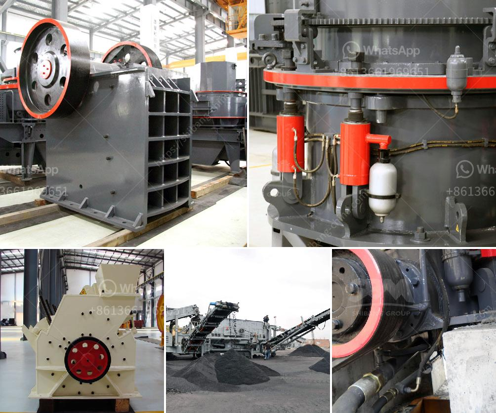

<h3>telcum powder plant manufacturer</h3>
Talcum powder, a popular hygiene product used by millions of people around the world, is manufactured through a complex process that requires specialized equipment and expertise. Talcum powder plant manufacturers play a crucial role in providing quality products to meet the increasing demand for this versatile and essential consumable.

Talcum powder is primarily made from talc, a naturally occurring mineral. The mineral is extracted, processed, and then refined to create a fine powder that is widely used for various purposes. From personal care products like baby powder and body powders to cosmetics and even industrial applications such as rubber, ceramics, and paint, talcum powder has a wide range of uses.

The process of manufacturing talcum powder involves several stages. First, the raw material is mined from talc deposits, which are found in different parts of the world, including the United States, China, India, and Brazil. Once extracted, the talc is crushed and ground into a fine powder.

Talcum powder plants require advanced machinery and equipment to ensure the production of high-quality products. These plants typically consist of crushers, grinders, classifiers, conveyors, and kilns, all of which work in harmony to produce the desired final product. Additionally, the entire manufacturing process must meet strict quality control standards to ensure that the powdered talc is safe for use and free from any impurities or contaminants.

Talcum powder plant manufacturers invest significant time and resources in research and development to improve the manufacturing process and enhance the quality of their products. They aim to produce powders with a consistent particle size to ensure optimal performance and user satisfaction. Furthermore, manufacturers frequently test their talcum powders for safety, irritability, and allergenicity to meet international safety standards and regulations.

In recent years, talcum powder manufacturers have faced increasing scrutiny due to concerns regarding potential health risks associated with the use of talc. Some studies suggest a link between talcum powder and ovarian cancer, respiratory issues, and even mesothelioma due to possible asbestos contamination. Consequently, manufacturers are taking steps to ensure the safety of their products, such as implementing stringent quality control measures and using additives to minimize potential risks.

Despite these concerns, talcum powder remains a highly sought-after product worldwide. Consumers continue to rely on the soothing and absorbent qualities of talcum powder for personal hygiene and other applications. Talcum powder plant manufacturers continuously strive to maintain the trust of their customers by providing safe and high-quality products.

In conclusion, talcum powder plant manufacturers are essential in meeting the global demand for talcum powder. Their expertise, advanced machinery, and commitment to quality ensure the production of safe and reliable products. As consumer awareness grows, manufacturers continue to adapt and invest in research and development to address concerns and provide talcum powders that meet the highest safety standards.
<h3>Contact us</h3><ul><li><strong>Whatsapp:&nbsp;<a href="https://wa.me/8613661969651">+8613661969651</a></strong></li><li><a href="https://swt.shibang-china.com/?git&amp;zhl&amp;telcum powder plant manufacturer"><strong>Online Service(chat now)</strong></a></li></ul><h3>Related</h3><ul><li><a href='construction  demolition recycling.md'>construction & demolition recycling</a></li><li><a href='used korean made stone crusher.md'>used korean made stone crusher</a></li><li><a href='stone crusher machine price for plant.md'>stone crusher machine price for plant</a></li><li><a href='silicon wafer crusher.md'>silicon wafer crusher</a></li><li><a href='jaw crusher quotes.md'>jaw crusher quotes</a></li></ul>