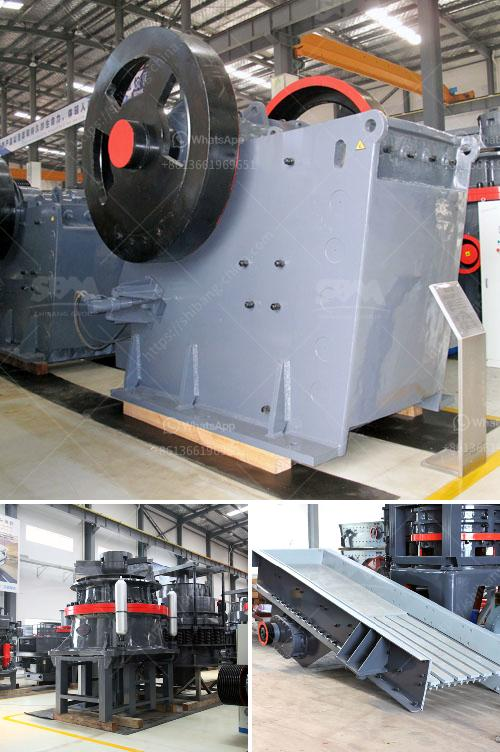

<h3>tertiary stone crusher</h3>
Tertiary Stone Crusher, manufactured from Henan Fote Machinery Ltd., is especially suitable for making abrasive, refractory material, cement, quartz sand, steel sand, slag powder, copper ore, etc. There are different types of tertiary crushers like tertiary impact crushers and tertiary cone crushers. Mining tertiary crusher is an efficient, energy-saving crushing equipment that can save energy 50% than traditional crushers. The tertiary stone crusher is also be called fine crusher.

As the name suggests, it is a crusher for fine crushing and always used after coarse crushers like concrete jaw crushers and secondary crushers like impact crushers and cone crushers. Applied raw materials Advantages of tertiary crusher Fine crusher is also known as high efficiency fine crusher or tertiary crusher. The crushing materials compressive strength is less than 100Mpa and the surface moisture is less than 15%. Tertiary stone crusher is widely used in various fields and its performance has reached the international leading level, special suitable for fine and medium crushing for hard and brittle materials such as refractoriess, cement, quartz sand, steel sand, slag powder, copper ore, iron ore, gold sand, concrete aggregate, asphalt aggregate, etc.

1.Reduce distribution wear parts It can effectively prolong the life of wear parts and improve the crusher's feed size; applicable to processing coarse, fine or fine materials; stable operation, convenient maintenance, high processing capacity and high production capacity. 2.Large crushing ratio and high efficiency The crushing ratio of the tertiary crusher, which is also known as the tertiary crushing equipment, is more than 3:1. The particle size of the finished material is fine and uniform, and the content of powder and dust is low, which is a high-quality fine crushing equipment. 3.Energy-saving and environmental protection The tertiary crusher has the advantages of low energy consumption, high efficiency, and easy installation and maintenance, and knows more about the changing rules of the wear rate of the wear-resistant parts and the life of the wear parts. The above is the sharing of professional manufacturers on the advantages of tertiary crushers.

The tertiary crusher is mainly used for crushing and grinding rocks and minerals into sand particles. The tertiary crushers produced by our company are widely used in crushing rocks and minerals for building, chemical industry, metallurgy, refractory materials and other industrial sectors. Since we have the most advanced technology and the most professional engineers, we can also design the stationary and mobile tertiary crusher for different customers according to their requirements. The tertiary crushers produced by our company are mainly domestic, such as tertiary stone crusher, tertiary impact crusher, and tertiary cone crusher. Etc., the tertiary crusher is known for its low energy consumption, high efficiency and energy-saving. With its high yield and good product particle size, it is widely used in stone crushing and sand making industries. The tertiary crusher is mainly used for crushing and grinding rocks and minerals into sand particles.
<h3>Contact us</h3><ul><li><strong>Whatsapp:&nbsp;<a href="https://wa.me/8613661969651">+8613661969651</a></strong></li><li><a href="https://swt.shibang-china.com/?git&amp;zhl&amp;tertiary stone crusher"><strong>Online Service(chat now)</strong></a></li></ul><h3>Related</h3><ul><li><a href='lime and dolomite plant division.md'>lime and dolomite plant division</a></li><li><a href='total costing of stone crusher in maharashtra.md'>total costing of stone crusher in maharashtra</a></li><li><a href='diagram of a hammer mill machine.md'>diagram of a hammer mill machine</a></li><li><a href='automation conveyor belts.md'>automation conveyor belts</a></li><li><a href='silicon wafer crusher.md'>silicon wafer crusher</a></li></ul>