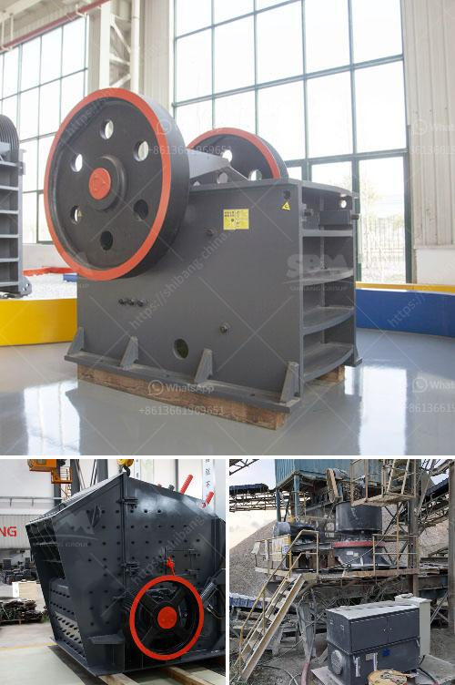

<h3>tertiary vertical shaft impact crusher</h3>
It is common knowledge that cone crushers are widely used in the mining industry for ore processing. However, what many people do not know is that there is yet another type of crusher that can provide a final product with even finer dimensions. The tertiary vertical shaft impact crusher, or VSI, is a highly durable alternative that requires less maintenance and produces a more cubical product. With features such as well balanced rotor design, replaceable wear parts, and easy maintenance, this crusher has become a game-changer in the crushing industry.

One of the key advantages of the tertiary VSI crusher is its ability to produce a more cubical product compared to traditional cone crushers. This is due to its unique rock-on-rock crushing principle, which utilizes the materials' own high-velocity impact to break and shape the stone. The cubical shape is highly desirable in industries such as concrete and asphalt production, as it allows for better compaction and a higher-quality end product. Furthermore, the VSI crusher can efficiently process materials with high abrasiveness, such as quartz, granite, or basalt, giving it an edge over other crushers.

Another major advantage of the tertiary VSI crusher is its low operational costs. The crusher's rotor design is well balanced, ensuring reduced vibration and extended bearing life. Moreover, the use of high-quality wear-resistant materials in the rotor and crushing chamber liners increases the crusher's durability, resulting in lower maintenance costs. Additionally, the replaceable wear parts make it easy and cost-effective to maintain the crusher, reducing downtime and increasing productivity.

In terms of application, the tertiary VSI crusher is highly versatile. It can be used in various stages of the crushing process, whether as a tertiary crusher after a primary or secondary crusher, or as a standalone unit for specific applications. Its adjustability allows for precise control over the final product gradation, making it ideal for producing quality aggregates for construction purposes. Additionally, the VSI crusher can be used for the production of manufactured sand, allowing for the efficient utilization of resources.

Furthermore, the tertiary VSI crusher allows for better shaping and grading of materials compared to other crushers. Its rock-on-rock crushing principle results in a higher percentage of desirable end products, with fewer fines. This is particularly beneficial for customers who require consistent quality in their end products. Moreover, the crusher's ability to produce different fractions of products makes it suitable for a wide range of applications, from concrete production to road construction.

In conclusion, the tertiary vertical shaft impact crusher is a highly efficient and durable alternative to traditional cone crushers. With its rock-on-rock crushing principle and well-balanced rotor design, it produces a more cubical product with lower maintenance costs. Its versatility allows for various applications, while its ability to shape and grade materials ensures a high-quality end product. As the crushing industry looks for innovations that can increase productivity and reduce costs, the tertiary VSI crusher has proven to be a game-changer.
<h3>Contact us</h3><ul><li><strong>Whatsapp:&nbsp;<a href="https://wa.me/8613661969651">+8613661969651</a></strong></li><li><a href="https://swt.shibang-china.com/?git&amp;zhl&amp;tertiary vertical shaft impact crusher"><strong>Online Service(chat now)</strong></a></li></ul><h3>Related</h3><ul><li><a href='gold stone crusher machine south africa.md'>gold stone crusher machine south africa</a></li><li><a href='the gold mining process in zimbabwe.md'>the gold mining process in zimbabwe</a></li><li><a href='looking for used pulverizer machine.md'>looking for used pulverizer machine</a></li><li><a href='vibrating sieve supplier in south africa.md'>vibrating sieve supplier in south africa</a></li><li><a href='vibrating feeder screen.md'>vibrating feeder screen</a></li></ul>