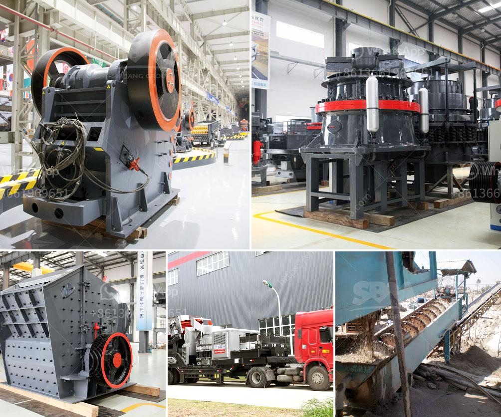

<h3>the best crusher machines</h3>
Crusher machines are essential equipment in mining, construction, and other industries where breaking down large material into smaller pieces is vital. The choice of these machinery can significantly impact productivity, efficiency, and the overall success of a project. In this article, we will discuss some of the best crusher machines available on the market today, highlighting their features and benefits.

Jaw crushers are versatile machines commonly used for primary and secondary crushing of minerals and rocks. They operate by compressing the material between two jaws, one fixed and the other movable. Some of the key advantages of jaw crushers include their high productivity, reliability, and ease of maintenance. Additionally, they offer excellent reduction ratios and can handle even the toughest materials.

Cone crushers are popular in both the mining and construction industries for their ability to crush various materials efficiently. These machines have a cone-shaped crushing chamber that allows material to be compressed between a mantle and a concave lining. Cone crushers are known for their excellent particle shape, high reduction ratios, and low operation costs. They are suitable for secondary, tertiary, and quaternary crushing applications.

Impact crushers are powerful machines that utilize high-speed impact forces to crush materials. They are often used in primary, secondary, and tertiary crushing processes. Impact crushers are known for their high reduction ratios and the ability to produce precisely shaped cubical end products. They are favored for their low operating costs and ease of maintenance.

Gyratory crushers are primarily used in the mining industry for heavy-duty crushing of large rocks and ore. These machines have a conical crushing head gyrating inside a bowl-shaped chamber, which produces a squeezing and grinding action. Gyratory crushers offer high capacity and are ideal for handling materials with high hardness and abrasive properties. Their robust design ensures long service life and low maintenance requirements.

VSI crushers are commonly used in the production of high-quality manufactured sand and shaping aggregates. They work by accelerating rocks against a solid surface, resulting in a high reduction ratio and excellent particle shape. VSI crushers are highly efficient machines that consume less power compared to other crushing equipment, making them economical to operate.

When choosing the best crusher machine for a specific application, several factors should be considered. Material type, feed size, required product size, and desired capacity are all important considerations. Additionally, considering the machine's overall performance, maintenance requirements, and operating costs will ensure a wise investment.

In conclusion, the market offers a wide range of crusher machines suitable for different applications. Jaw crushers, cone crushers, impact crushers, gyratory crushers, and VSI crushers all have their merits depending on the specific requirements of the project. By carefully evaluating these factors, one can select the best crusher machine to optimize productivity, efficiency, and profitability.
<h3>Contact us</h3><ul><li><strong>Whatsapp:&nbsp;<a href="https://wa.me/8613661969651">+8613661969651</a></strong></li><li><a href="https://swt.shibang-china.com/?git&amp;zhl&amp;the best crusher machines"><strong>Online Service(chat now)</strong></a></li></ul><h3>Related</h3><ul><li><a href='stone crusher kapasitas.md'>stone crusher kapasitas</a></li><li><a href='aggregate crusher 200 meter capacity.md'>aggregate crusher 200 meter capacity</a></li><li><a href='total costing of stone crusher in maharashtra.md'>total costing of stone crusher in maharashtra</a></li><li><a href='top 10 stone crusher companies in india.md'>top 10 stone crusher companies in india</a></li><li><a href='mobile jaw crushers.md'>mobile jaw crushers</a></li></ul>