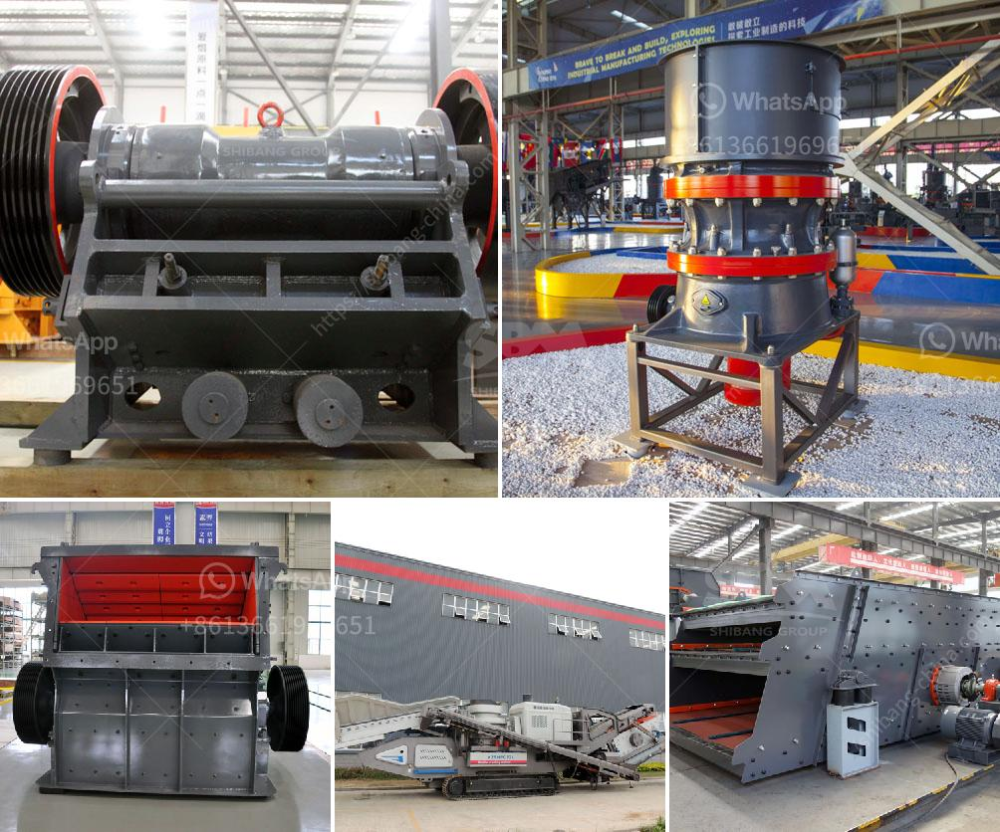

<h3>the gold mining process in zimbabwe</h3>
Gold mining in Zimbabwe, particularly within the Mazowe area, has been a source of controversy and concern for many years. The process usually involves numerous stages, beginning with the extraction and crushing of ore. This is followed by smelting and purification, where the gold is purified and made into its final form before it can be sold on the market.

The gold mining process in Zimbabwe has faced several challenges. Firstly, there is the issue of illegal mining, which has led to the exploitation of miners and environmental degradation. Many individuals and companies have resorted to illegal means to extract gold, often without regard for safety measures or environmental regulations.

Furthermore, artisanal and small-scale mining (ASM) has also presented challenges. ASM operations often involve the use of rudimentary tools and techniques, making it difficult to achieve optimal recovery rates. Limited access to capital and outdated technology further hinder the mining process.

To address these challenges, the Zimbabwean government has implemented various reforms, including the provision of assistance to small-scale miners through the Reserve Bank of Zimbabwe (RBZ). The RBZ has set up a $20 million fund to provide loans to artisanal and small-scale miners, enabling them to acquire modern equipment and adopt safer and more efficient mining methods.

Additionally, the government has put in place stricter regulations to curb illegal mining activities. Special police units have been set up to combat illegal mining, and perpetrators are being brought to justice.

Despite the challenges, the gold mining industry in Zimbabwe continues to play a significant role in the country's economy. Zimbabwe is known for having vast gold reserves, and the potential for further exploration and development is enormous.

However, it is crucial for the government and stakeholders to ensure that the mining process is conducted sustainably and responsibly. Proper environmental management and the protection of miners' rights should be at the forefront of all mining operations. With the right approach, the gold mining industry in Zimbabwe can continue to thrive, benefitting the country and its citizens while minimizing the negative impact on the environment.
<h3>Contact us</h3><ul><li><strong>Whatsapp:&nbsp;<a href="https://wa.me/8613661969651">+8613661969651</a></strong></li><li><a href="https://swt.shibang-china.com/?git&amp;zhl&amp;the gold mining process in zimbabwe"><strong>Online Service(chat now)</strong></a></li></ul><h3>Related</h3><ul><li><a href='sand washing machine lsx.md'>sand washing machine lsx</a></li><li><a href='crusher stone price.md'>crusher stone price</a></li><li><a href='100tph stone crusher sale in south africa.md'>100tph stone crusher sale in south africa</a></li><li><a href='impact crusher machine.md'>impact crusher machine</a></li><li><a href='jaw crusher supplier of new zealand.md'>jaw crusher supplier of new zealand</a></li></ul>