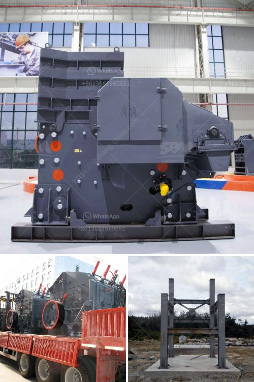

<h3>the process of belt conveyor</h3>
Belt conveyors have become an essential tool in the transportation and packaging industry. These rotating belts are designed to move materials from one place to another, efficiently and quickly. Belt conveyors are widely used in various industries, including mining, agriculture, manufacturing, and logistics.

The process of a belt conveyor revolves around the movement of a continuous looped belt. The belt is supported by a series of idlers or rollers, allowing it to carry materials along its path. Let's explore the key steps involved in the belt conveyor process.

1. Design and Selection of the Belt Conveyor: The first step in the process is to design and select the appropriate belt conveyor system for the specific application. Factors such as the type and weight of the material being transported, the distance to be covered, and the required speed of transportation are taken into consideration. Belt conveyors come in various lengths, widths, and load capacities to meet different requirements.

2. Belt Construction: Once the appropriate belt conveyor is selected, the belt itself is constructed. Conveyor belts are made of layers of rubber or fabric, reinforced with materials like nylon, polyester, or steel cords. These layers provide strength and durability to the belt, making it capable of carrying heavy loads.

3. Belt Tensioning: Proper tensioning of the belt is crucial for effective conveyor operation. The belt must be tensioned neither too tight nor too loose. Tensioning devices are used to maintain the desired tension within the belt, ensuring smooth and efficient transportation.

4. Loading and Unloading: The material to be transported is loaded onto the belt at the starting point of the conveyor. This can be done manually, using equipment like forks or shovels, or through automated systems. At the other end of the conveyor, the material is unloaded using similar methods. Some belt conveyors also have integrated sorting mechanisms to direct the material to different destinations.

5. Tracking and Alignment: To prevent the belt from slipping or wandering off its intended path, tracking and alignment systems are installed. These systems use sensors and controls to detect any misalignment or deviation of the belt and automatically correct it. This ensures the conveyor operates smoothly and prevents damage to the belt.

6. Maintenance: Regular maintenance is essential to keep the belt conveyor running efficiently. This includes inspecting and repairing any damaged parts, lubricating the moving components, and cleaning the belt to remove debris or material buildup. Proper maintenance can extend the lifespan of the conveyor and minimize downtime.

In conclusion, the belt conveyor process involves a series of well-defined steps that ensure the smooth and efficient transportation of materials. From the initial design and selection to the loading, unloading, and maintenance, each step plays a crucial role in the overall functioning of the conveyor system. Belt conveyors have revolutionized the transportation industry, making it easier and more efficient to move goods from one place to another.
<h3>Contact us</h3><ul><li><strong>Whatsapp:&nbsp;<a href="https://wa.me/8613661969651">+8613661969651</a></strong></li><li><a href="https://swt.shibang-china.com/?git&amp;zhl&amp;the process of belt conveyor"><strong>Online Service(chat now)</strong></a></li></ul><h3>Related</h3><ul><li><a href='production line for calcium carbonate.md'>production line for calcium carbonate</a></li><li><a href='coal mining processes and machinary required.md'>coal mining processes and machinary required</a></li><li><a href='what is expected cost of 100 tph crushing plant.md'>what is expected cost of 100 tph crushing plant</a></li><li><a href='stone crusher application.md'>stone crusher application</a></li><li><a href='sand crusher machine hyderabad for sale.md'>sand crusher machine hyderabad for sale</a></li></ul>