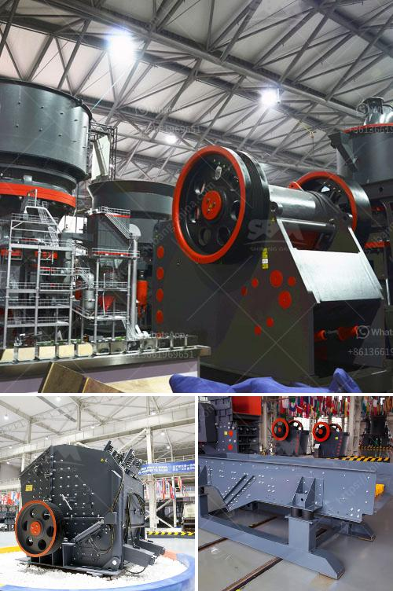

<h3>the weight of stone crusher</h3>
The weight of a stone crusher is influenced by a variety of factors, including the type of stone, its size, and hardness, the capacity of the crusher, dimensions of the machine, and the environment it is being used in. The weight of the crusher will vary depending on the material being crushed.

A stone crusher is typically made of various materials such as steel, iron, bronze, aluminum, and glass, which all contribute to its weight. The machine's body is usually made of steel or cast iron. The jaws, cones, and hammers, which are used in the crushing process, are also made of heavy steel or alloys. These heavy components add to the overall weight of the stone crusher.

The weight of the stone crusher varies depending on the size and type of the machine. Some of the most common sizes of stone crushers include:

- Small-size stone crusher: These machines are typically used for residential or small-scale construction projects. They weigh between 1 to 3 tons.

- Medium-size stone crusher: These machines are typically used for industrial and commercial purposes. They weigh between 3 to 10 tons.

- Large-size stone crusher: These machines are typically used for large-scale construction or mining projects. They can weigh over 10 tons.

In addition to the size and type of the stone crusher, the weight is also influenced by its capacity. The capacity of a stone crusher refers to the maximum amount of material it can crush within a certain timeframe. Stone crushers with higher capacity tend to be heavier because they require more powerful motors and stronger components to accommodate the increased workload.

The dimensions of the stone crusher also impact its weight. Machines with larger dimensions, such as a longer conveyor belt or a taller crushing chamber, will generally be heavier compared to machines with smaller dimensions.

Lastly, the environment in which the stone crusher is being used can affect its weight. For instance, a stone crusher used in a quarry or mining site may have additional features such as a heavy-duty chassis or reinforced tracks to withstand rough terrain. These additional features can increase the weight of the stone crusher.

In conclusion, the weight of a stone crusher can vary depending on factors such as the type of stone, its size and hardness, the capacity of the machine, dimensions, and the environment it is being used in. Understanding the weight of a stone crusher is crucial for anyone involved in the construction or mining industry to ensure that the appropriate machinery is chosen for the job.
<h3>Contact us</h3><ul><li><strong>Whatsapp:&nbsp;<a href="https://wa.me/8613661969651">+8613661969651</a></strong></li><li><a href="https://swt.shibang-china.com/?git&amp;zhl&amp;the weight of stone crusher"><strong>Online Service(chat now)</strong></a></li></ul><h3>Related</h3><ul><li><a href='sand and gravel exploration equipment.md'>sand and gravel exploration equipment</a></li><li><a href='portable impact crushers.md'>portable impact crushers</a></li><li><a href='fuel consumption of stone crushers.md'>fuel consumption of stone crushers</a></li><li><a href='feasiblity study of a fero chrome crushing plant.md'>feasiblity study of a fero chrome crushing plant</a></li><li><a href='stone quarry machines for sale.md'>stone quarry machines for sale</a></li></ul>