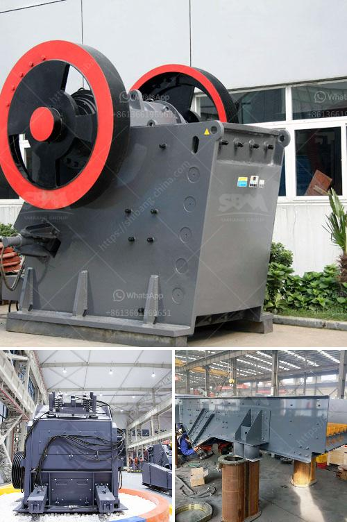

<h3>to buy mobile crushing plant price</h3>
When it comes to purchasing a mobile crushing plant, the prices can vary greatly depending on the size, capacity, and capabilities of the machine. In this article, we will explore the factors to consider when buying a mobile crushing plant, as well as the average price ranges for different models.

First and foremost, it is essential to determine your specific needs and requirements. Are you looking for a mobile crushing plant for large-scale mining operations or smaller construction projects? What material will you be crushing? How much capacity do you need? Answering these questions will help ascertain the right machine for your job.

The price of a mobile crushing plant can range from tens of thousands to millions of dollars, depending on the model, brand, and capacity. In general, the price starts around $100,000 and can go up to $500,000 or even more. It is crucial to keep in mind that the cost of a mobile crushing plant is not only determined by its initial purchase price but also by factors like operational and maintenance costs throughout its lifespan.

One crucial factor that can impact the price of a mobile crushing plant is its capacity. Generally, the higher the capacity, the higher the price. For example, a plant with a capacity of 100 tons per hour would be less expensive than a plant with a capacity of 500 tons per hour.

Another factor that influences the price is the brand. Well-known brands with a reputation for high-quality and reliable machinery often come with a higher price tag. However, investing in a reputable brand can provide peace of mind in terms of performance, durability, and after-sales support.

Additionally, the features and capabilities of the mobile crushing plant can affect its price. Advanced features such as remote monitoring, automatic control systems, and mobile connectivity may add to the cost, but they can greatly enhance operational efficiency and productivity.

Apart from the initial purchase price, it is essential to consider the ongoing costs of owning a mobile crushing plant. Maintenance, operation, fuel consumption, and spare parts are among the factors that can impact the total cost of ownership. It is advisable to research the maintenance requirements and availability of spare parts for the chosen machine before making a purchase.

To ensure that you get the best value for your money, it is recommended to compare prices, features, and specifications from multiple suppliers. Request quotes from reputable suppliers and carefully evaluate the details provided. It is also worth considering potential financing options, such as lease agreements or machinery loans, to make the purchase more manageable.

In conclusion, buying a mobile crushing plant requires careful consideration of various factors. The size, capacity, brand, features, and ongoing costs are crucial elements to assess when determining the price range. By doing thorough research and comparing multiple options, you can make an informed decision and find the right mobile crushing plant for your specific needs.
<h3>Contact us</h3><ul><li><strong>Whatsapp:&nbsp;<a href="https://wa.me/8613661969651">+8613661969651</a></strong></li><li><a href="https://swt.shibang-china.com/?git&amp;zhl&amp;to buy mobile crushing plant price"><strong>Online Service(chat now)</strong></a></li></ul><h3>Related</h3><ul><li><a href='companies of conveyor belts in mexico.md'>companies of conveyor belts in mexico</a></li><li><a href='differences between jaw and gyratory crushers.md'>differences between jaw and gyratory crushers</a></li><li><a href='model project of soap stone powder.md'>model project of soap stone powder</a></li><li><a href='diamond stone crusher price list.md'>diamond stone crusher price list</a></li><li><a href='used ball mill for sale india.md'>used ball mill for sale india</a></li></ul>