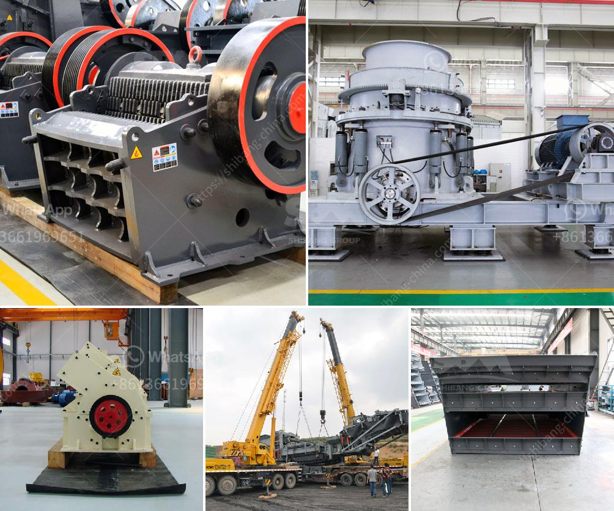

<h3>to ton hr rock crushers</h3>
The mining and construction industries rely heavily on rock crushers to break down large rocks into smaller, more manageable pieces. These crushers play a crucial role in enhancing productivity and reducing operational costs. In recent years, the advent of advanced technology has led to the development of powerful 2 ton/hr rock crushers, capable of effortlessly handling higher crushing capacities. This article aims to explore the advantages of utilizing these innovative machines and their impact on the industry as a whole.

Traditional rock crushers had limitations in terms of their crushing capacities, often requiring multiple units to process significant amounts of material. However, modern 2 ton/hr rock crushers have revolutionized the industry. With higher horsepower, improved design, and enhanced crushing mechanisms, these crushers can now tackle larger rocks, reducing the need for excessive equipment and bolstering operational efficiency. Consequently, the streamlined workflow provides significant time and cost savings while boosting productivity.

Downtime is a significant concern for any mining or construction operation, as it leads to financial losses and project delays. The enhanced design of 2 ton/hr rock crushers enhances their durability and reduces the risk of breakdowns. Coupled with advanced maintenance protocols and easier access to critical components, these machines experience minimal downtime, resulting in uninterrupted crushing operations.

2 ton/hr rock crushers are highly versatile, capable of handling a wide range of aggregate materials. They can efficiently crush various types of rocks, including limestone, granite, quartz, basalt, and more. This versatility allows operators to adapt to different project requirements and switch between materials without the need for additional crushers. Moreover, with adjustable settings, operators can produce a range of desired aggregate sizes, ensuring a diverse output for various construction purposes.

Investing in 2 ton/hr rock crushers offers significant cost advantages over traditional crushers. While the initial investment may be higher, the improved efficiency, reduced downtime, and increased productivity lead to substantial savings in the long run. By effectively breaking down larger rocks in a single pass, these crushers eliminate the need for additional crushing stages, reducing energy consumption and operational costs. Additionally, their durability and resistance to wear and tear result in fewer replacement and maintenance costs.

Alongside increased efficiency and cost savings, modern 2 ton/hr rock crushers offer environmental advantages, reducing the overall carbon footprint of mining and construction operations. The improved motor technology and reduced energy consumption contribute to lower greenhouse gas emissions. Furthermore, consolidating crushing processes into a single unit reduces the overall machinery requirements, leading to a smaller impact on natural resources and ecosystem disruption.

The emergence of 2 ton/hr rock crushers represents a significant advancement in the mining and construction industries. These powerful machines deliver improved efficiency, reduced downtime, and remarkable cost savings, making them an asset to any operation. Their versatility and environmentally friendly design not only enhance operational capacity but also contribute to sustainable practices within the industry. As technology continues to advance, the future of rock crushing looks promising, with the potential for even more efficient and environmentally conscious machines.
<h3>Contact us</h3><ul><li><strong>Whatsapp:&nbsp;<a href="https://wa.me/8613661969651">+8613661969651</a></strong></li><li><a href="https://swt.shibang-china.com/?git&amp;zhl&amp;to ton hr rock crushers"><strong>Online Service(chat now)</strong></a></li></ul><h3>Related</h3><ul><li><a href='stone grinder machines for sale usa.md'>stone grinder machines for sale usa</a></li><li><a href='tpd mini cement plant cost in india.md'>tpd mini cement plant cost in india</a></li><li><a href='sand and gravel exploration equipment.md'>sand and gravel exploration equipment</a></li><li><a href='jaw crusher each equipment.md'>jaw crusher each equipment</a></li><li><a href='grinding machine information in hindi.md'>grinding machine information in hindi</a></li></ul>