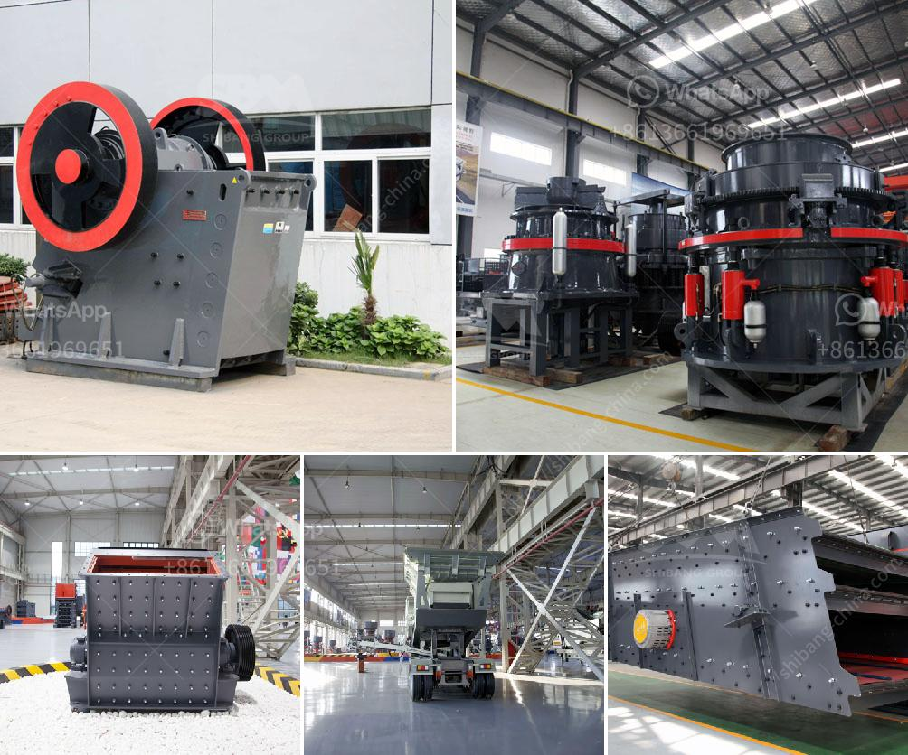

<h3>tonnes aggregate crusher in south africa crusher</h3>
In South Africa, aggregates play a vital role in the construction industry. They are the cornerstone of concrete, asphalt, and other construction materials used in various infrastructure projects. With the growing demand for aggregates, the need for efficient crushers has become paramount. One such crusher is the tonnes aggregate crusher, which is designed to provide superior performance and versatility.

The tonnes aggregate crusher is a heavy-duty machine that is specifically designed to crush large and hard materials into smaller pieces. It features a unique crushing chamber design, which enhances the crusher's capacity and efficiency. With a crushing capacity of up to 800 tonnes per hour, this crusher can easily handle even the toughest materials, such as granite, basalt, and limestone.

One of the standout features of the tonnes aggregate crusher is its mobility. It can be easily transported to different construction sites, allowing for efficient and convenient crushing operations. This is particularly crucial in South Africa, where construction projects are often scattered across vast distances. The portability of this crusher ensures that aggregates can be produced on-site, reducing transportation costs and enhancing overall project efficiency.

Furthermore, the tonnes aggregate crusher is equipped with advanced automation systems, making it easy to operate and control. It features a user-friendly interface that allows operators to adjust the settings according to their specific requirements. Additionally, the crusher's automation system improves safety by preventing overloading and reducing the risk of accidents.

Another significant advantage of the tonnes aggregate crusher is its low operating costs. It is designed to consume less energy, resulting in lower electricity bills and reduced carbon footprint. Additionally, its robust construction and high-quality components ensure minimal maintenance requirements, reducing downtime and increasing productivity.

The tonnes aggregate crusher is manufactured by leading industry professionals who prioritize durability and reliability. Every crusher undergoes rigorous testing to ensure it meets the highest quality standards. This ensures that customers can rely on this machine to deliver consistent and exceptional performance, even in the harshest operating conditions.

In conclusion, the tonnes aggregate crusher is an essential machine in the South African construction industry. Its high crushing capacity, mobility, and advanced automation systems make it an efficient and cost-effective solution for producing high-quality aggregates. By choosing this crusher, construction companies can enhance their productivity, reduce costs, and contribute to a more sustainable future.
<h3>Contact us</h3><ul><li><strong>Whatsapp:&nbsp;<a href="https://wa.me/8613661969651">+8613661969651</a></strong></li><li><a href="https://swt.shibang-china.com/?git&amp;zhl&amp;tonnes aggregate crusher in south africa crusher"><strong>Online Service(chat now)</strong></a></li></ul><h3>Related</h3><ul><li><a href='price jaw crusher 100tph india.md'>price jaw crusher 100tph india</a></li><li><a href='crusher philippines.md'>crusher philippines</a></li><li><a href='equipment required for producing lime for new plant.md'>equipment required for producing lime for new plant</a></li><li><a href='silica sand mining machine.md'>silica sand mining machine</a></li><li><a href='ball mill hammer.md'>ball mill hammer</a></li></ul>