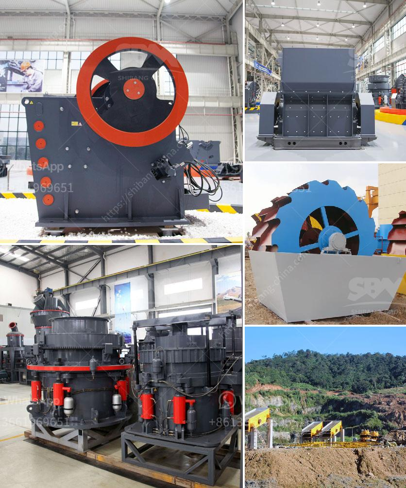

<h3>tons per day ball mill</h3>
A ball mill is a type of grinding mill which is used to grind and blend materials for use in mineral dressing processes, paints, pyrotechnics, ceramics, and selective laser sintering. It works on the principle of impact and attrition: size reduction is done by impact as the balls drop from near the top of the shell. 

A ball mill consists of a hollow cylindrical shell rotating about its axis. The axis of the shell may be either horizontal or at a small angle to the horizontal. It is partially filled with balls. The grinding media are the balls, which may be made of steel, stainless steel, ceramic, or rubber. The inner surface of the cylindrical shell is usually lined with an abrasion-resistant material such as manganese steel or rubber. 

In a ball mill, the particles are ground by repeated impact forces. The material to be ground is fed into the ball mill through a central inlet, and then it is ground and discharged through the outlet. The discharged material is fine and can be further classified through a hydrocyclone classifier. 

A ball mill operates continuously, meaning that the material that goes in is ground and discharged over and over again, ensuring continuous production. Tons per day is a measure of the grinding capacity of the mill. Industrial ball mills can operate continuously, fed at one end and discharged at the other end. Large to medium-sized ball mills are mechanically rotated on their axis, but small ones normally consist of a cylindrical capped container that sits on two drive shafts (pulleys and belts are used to transmit rotary motion). 

The throughput of a ball mill ranges from a few tons per day to more than 1000 tons per day, depending on the mill size, the nature of the feed material, and the required product size. The mills can be operated in open circuit, feeding directly into the downstream process, or in a closed circuit with a classifier. 

A ball mill is widely used in production lines for powders such as cement, silicates, refractory material, fertilizer, glass ceramics, etc., as well as for ore dressing of both ferrous and non-ferrous metals. The ball mill can grind various ores and other materials either wet or dry. There are many types of ball mills in the market, including overflow type ball mill, grate discharge type ball mill, and laboratory ball mill. 

Overall, tons per day ball mills are an essential piece of equipment in the production of many products. They provide an efficient and cost-effective method for grinding materials to the desired fineness and are used widely in various industries. Whether for large-scale industrial production or small-scale laboratory testing, ball mills are a reliable and versatile tool for any grinding operation.
<h3>Contact us</h3><ul><li><strong>Whatsapp:&nbsp;<a href="https://wa.me/8613661969651">+8613661969651</a></strong></li><li><a href="https://swt.shibang-china.com/?git&amp;zhl&amp;tons per day ball mill"><strong>Online Service(chat now)</strong></a></li></ul><h3>Related</h3><ul><li><a href='crusher peru price.md'>crusher peru price</a></li><li><a href='stone crushing machine in zambia.md'>stone crushing machine in zambia</a></li><li><a href='conical ball mill manufacturers in india.md'>conical ball mill manufacturers in india</a></li><li><a href='mobile crushing machine sales in south africa.md'>mobile crushing machine sales in south africa</a></li><li><a href='crusher machine supplier malaysia.md'>crusher machine supplier malaysia</a></li></ul>