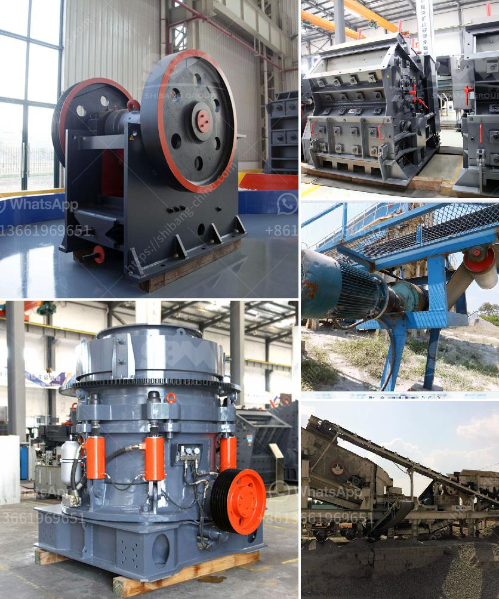

<h3>top 10 stone crusher companies in india</h3>
Stone crusher plays a crucial role in the mineral extraction process of mining industries. Whether it is limestone, granite, or coal, stone crushers can effectively break down large pieces of rock into smaller fragments and thereby facilitate easy disposal, recycling, and transport. With multiple stone crushing businesses operating in the market, locating the best one becomes a challenging task. To ease the task, we have compiled a list of the top ten stone crusher companies in India.

Mewar Hitech is a leading stone crushing company that has been providing quality services since 2006. The company is known for its innovative and advanced equipment that makes it the most preferred brand in the industry.

Metso is committed to innovative designs, advanced technology, and to providing outstanding customer support and solutions. Metso has a wide range of crushing and screening plants suitable for various applications.

Amarshiva Engineering Company is an established name in the industry, primarily engaged in crushing and screening equipment manufacturing. The company offers a wide range of crushers and screens that are specifically designed for the most demanding applications.

Eastman Crusher Company is a renowned manufacturer and supplier of various types of stone crushers, including jaw crushers, impact crushers, cone crushers, hammer crushers, and belt conveyors. With diligent efforts, they have carved a niche for themselves in the industry.

Propel Industries is another promising stone crushing company that offers technologically advanced solutions for various applications. With a strong focus on customer satisfaction, they design, engineer, and manufacture products that exceed expectations.

Nesans Mining and Automation Pvt Ltd. is a stone crusher machine manufacturer providing aggregates processing, segregation, classification, and automated control technology and services. With excellent technology and reliable after-sales service, the company has been faithfully serving customers for years.

Marsman India Ltd. is an ISO 9001:2008 company and a leading manufacturer of crushing and screening equipment for the past three decades. The company has been involved in some of the most ambitious infrastructure projects and consistently delivers quality products.

Puzzolana Machinery Fabricators LLP is a leading manufacturer of premium-quality crushing and screening plants, and machinery for use in mining, quarrying, road construction, and other industries. They boast a vast product range that includes jaw crushers, cone crushers, vertical shaft impactors, and screens.

Singh Crushers is one of the leading manufacturers of Crushing, Screening, and Conveying equipment in India, since 1964. They offer a wide range of machines that include jaw crushers, horizontal shaft impactors, horizontal screens, grizzly feeders, and allied equipment.

Royal Engineering is a distinguished manufacturer, supplier, and exporter of Industrial Crusher, Jaw Crusher, Impact Crusher, and other material handling equipment. They have a team of experienced engineers and skilled workers who consistently strive to provide customers with reliable products.

In conclusion, these stone crusher companies deliver products that are at the forefront of innovation and reliability. With a strong customer-centric approach, they continue to invest in research and development and focus on customer satisfaction. Selecting the right stone crusher company for your needs requires a diligent and meticulous evaluation of the company's capabilities, design, manufacturing processes, after-sales services, and more. By considering the top stone crusher companies, you can save your time and money while ensuring efficient and reliable stone crushing equipment for your business.
<h3>Contact us</h3><ul><li><strong>Whatsapp:&nbsp;<a href="https://wa.me/8613661969651">+8613661969651</a></strong></li><li><a href="https://swt.shibang-china.com/?git&amp;zhl&amp;top 10 stone crusher companies in india"><strong>Online Service(chat now)</strong></a></li></ul><h3>Related</h3><ul><li><a href='price of gypsum plant machines.md'>price of gypsum plant machines</a></li><li><a href='conveyor belts in coal transport sizing.md'>conveyor belts in coal transport sizing</a></li><li><a href='iron ore crusher machine.md'>iron ore crusher machine</a></li><li><a href='iron processing plant in mexico.md'>iron processing plant in mexico</a></li><li><a href='mill manufactures of hammer aryesanal.md'>mill manufactures of hammer aryesanal</a></li></ul>