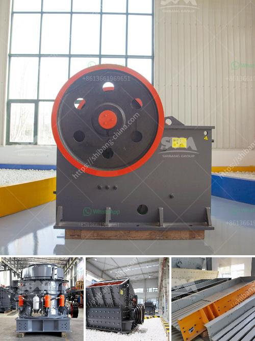

<h3>total costing of stone crusher in maharashtra</h3>
Stone crushing industry is an important industrial sector in the country engaged in producing crushed stone of various sizes depending upon the requirement which acts as raw material for various construction activities such as construction of roads, highways, bridges, buildings, and canals etc. It is estimated that there are over 12,000 stone crusher units in India. The number is expected to grow further keeping in view the future plans for development of infrastructure of roads, canals, and buildings that are required for overall development of the country.

In India, the Stone Crushing Industry sector is estimated to have an annual turnover of Rs. 5000 crore (equivalent to over US$ 1 billion) and is therefore an economically important sector. The sector is estimated to be providing direct employment to over 500,000 people engaged in various activities such as mining, crushing plant, transportation, quarrying, and machinery operation.

Stone crushing is an activity that does cause pollution by emitting pollutants such as suspended particulate matter, dust, and gases. The stone crushing units in Maharashtra are estimated to produce 56.11 tonnes of dust annually, generating dust mostly from crusher units at lime-prepared stone crusher units in Maharashtra. The workers are exposed to stone dust which leads to higher prevalence of respiratory diseases especially in areas with high prevalence of silicosis.

The stone crusher units in Maharashtra are typically located in close proximity to the villages and towns surrounding them. It is recommended to provide adequate provisions for dust suppression and fresh water sprinkling to avoid pollution and mitigate health risks for the workers. Additionally, it is important to ensure that proper safety measures are in place to prevent any accidents or injuries during the operation of the crusher units.

The total cost of a stone crusher in Maharashtra includes the cost of the machinery, transportation, and infrastructure required for the operation. Additionally, the cost of maintaining and operating the machinery is also significant. The stone crushers can be classified into two main categories, namely, stationary and portable. Both types of crushers have their own pros and cons.

The stationary stone crusher is suitable for crushing hard and medium-hard rocks and ores, while the portable stone crusher is suitable for crushing materials such as soft, medium-hard and super-hard stones and ores. The cost of a stationary stone crusher is higher than that of a portable stone crusher due to the higher cost of machinery, transportation, and infrastructure required for operation.

In conclusion, the stone crusher industry in Maharashtra plays a crucial role in the overall development and growth of the national economy. However, it is important to ensure that the industry is operated in an environmentally responsible manner to mitigate its impact on the environment and the health of the workers. Adequate provisions for dust suppression and safety measures should be implemented to minimize pollution and accidents. The total costing of a stone crusher in Maharashtra should take into account the cost of machinery, transportation, and infrastructure required for operation to determine the overall cost of the unit.
<h3>Contact us</h3><ul><li><strong>Whatsapp:&nbsp;<a href="https://wa.me/8613661969651">+8613661969651</a></strong></li><li><a href="https://swt.shibang-china.com/?git&amp;zhl&amp;total costing of stone crusher in maharashtra"><strong>Online Service(chat now)</strong></a></li></ul><h3>Related</h3><ul><li><a href='grinder mill in bolivia.md'>grinder mill in bolivia</a></li><li><a href='jaw crusher for sale south africa.md'>jaw crusher for sale south africa</a></li><li><a href='clay ball mill machine.md'>clay ball mill machine</a></li><li><a href='sand manufacturing plant.md'>sand manufacturing plant</a></li><li><a href='quarry plant in nigeria.md'>quarry plant in nigeria</a></li></ul>