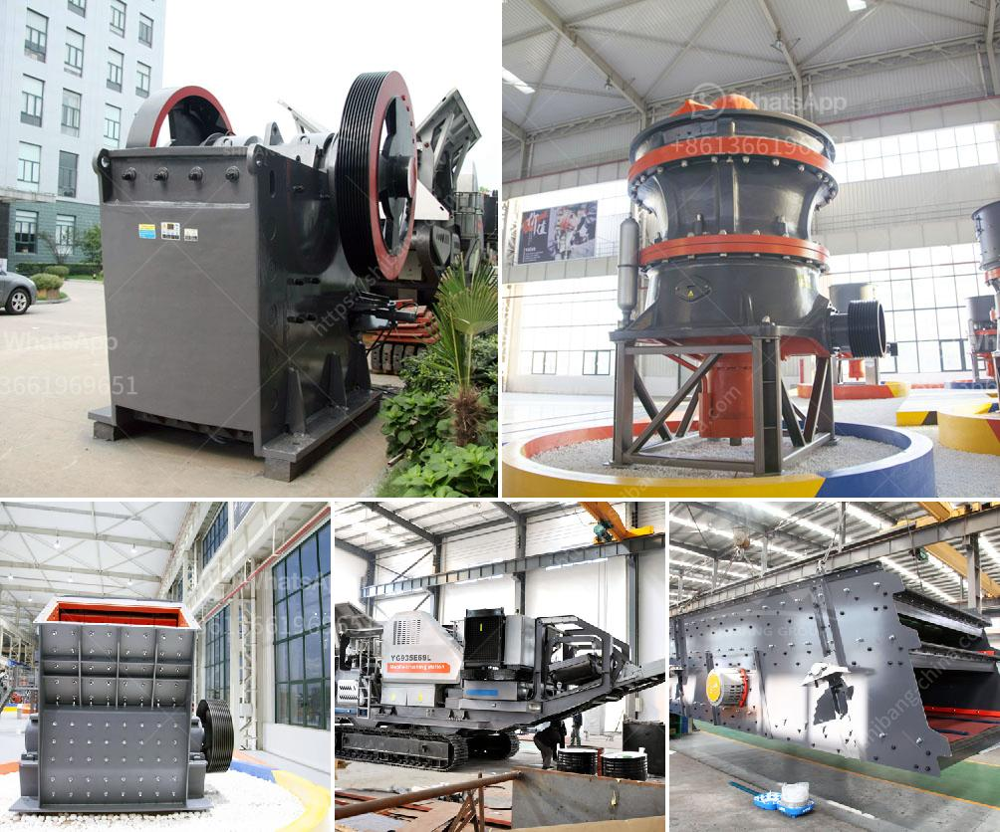

<h3>total power for jaw crusher 500 tph</h3>
The jaw crusher is ideally suitable for primary and secondary crushing with a low power consumption and easy maintenance. Every feature of this machine has been carefully designed to provide superior quality and performance.
<h3>Contact us</h3><ul><li><strong>Whatsapp:&nbsp;<a href="https://wa.me/8613661969651">+8613661969651</a></strong></li><li><a href="https://swt.shibang-china.com/?git&amp;zhl&amp;total power for jaw crusher 500 tph"><strong>Online Service(chat now)</strong></a></li></ul><h3>Related</h3><ul><li><a href='project cost of mini clinker grinding plant.md'>project cost of mini clinker grinding plant</a></li><li><a href='type of conveyors belt pdf.md'>type of conveyors belt pdf</a></li><li><a href='pulverizers bauxite.md'>pulverizers bauxite</a></li><li><a href='fly ash grinding mill.md'>fly ash grinding mill</a></li><li><a href='cost of 200tph stage bmw crushing plant.md'>cost of 200tph stage bmw crushing plant</a></li></ul>