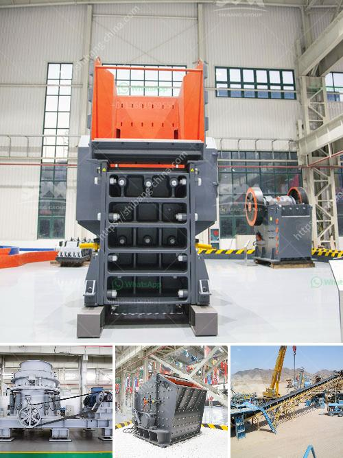

<h3>tpd mini cement plant cost in india</h3>
India is a vibrant country that has exhibited tremendous growth in various sectors. One such sector is the construction industry, which plays a crucial role in the country's economic development. As a result, there is a significant demand for cement, a key ingredient in the construction process. To cater to this demand, many entrepreneurs are considering setting up mini cement plants. In this article, we will discuss the cost of setting up such a plant in India.

A mini cement plant is a small-scale production facility that produces cement from various raw materials such as limestone, clay, sand, and iron ore. The size of a mini cement plant can vary, ranging from a capacity of 50tpd to 200tpd or even higher. These plants are compact and are equipped with all necessary machinery required for the production of cement.

The cost of setting up a mini cement plant in India depends on multiple factors. Firstly, the location of the plant plays a crucial role in determining the overall cost. The transportation costs of raw materials and finished goods to and from the plant can significantly impact the total cost. Moreover, the availability of power and infrastructure at the chosen location also needs to be considered.

Another significant cost is the machinery and equipment required for the plant. A typical mini cement plant includes a rotary kiln, a clinker grinding unit, and a cement blending unit. Additionally, there are various auxiliary equipment such as crushers, mills, conveyors, dust collectors, and storage silos. The cost of these machines depends on their capacity, quality, and technology.

Labor costs are another crucial aspect to be considered. India is known for its skilled and affordable labor force. However, the number of employees required in a mini cement plant is relatively lower compared to larger plants. The precise number of workers depends on the plant's capacity and level of automation. Therefore, labor costs are relatively lower in mini cement plants compared to large-scale plants.

Government regulations and taxation policies also affect the cost of setting up a mini cement plant. The entrepreneurs need to comply with various environmental norms and obtain necessary clearances and licenses. Additionally, taxation policies like GST (Goods and Services Tax) can impact the overall cost structure of the plant.

In general, the estimated cost of setting up a mini cement plant in India ranges from INR 25 to 50 crores (approximately USD 3.4 to 6.8 million) for a plant with a capacity between 50tpd and 200tpd. However, it is important to note that these are approximate figures and can vary significantly depending on various factors mentioned earlier.

Setting up a mini cement plant can be a profitable venture, considering the growing demand for cement in India. The cost of production in mini cement plants is relatively lower due to economies of scale and lower overhead costs. Moreover, these plants can cater to the local market demand efficiently while also contributing to job creation and economic growth in the region.

In conclusion, the cost of setting up a mini cement plant in India depends on various factors such as location, machinery and equipment, labor costs, government regulations, and taxation policies. Entrepreneurs willing to venture into this sector should thoroughly analyze all these factors to estimate the project cost accurately. By doing so, they can tap into the immense potential of the Indian construction industry and contribute to the nation's growth.
<h3>Contact us</h3><ul><li><strong>Whatsapp:&nbsp;<a href="https://wa.me/8613661969651">+8613661969651</a></strong></li><li><a href="https://swt.shibang-china.com/?git&amp;zhl&amp;tpd mini cement plant cost in india"><strong>Online Service(chat now)</strong></a></li></ul><h3>Related</h3><ul><li><a href='used concrete crushing plant for sale in uae.md'>used concrete crushing plant for sale in uae</a></li><li><a href='coal mining equipment south africa for sale.md'>coal mining equipment south africa for sale</a></li><li><a href='conventional hammer mills.md'>conventional hammer mills</a></li><li><a href='crusher application.md'>crusher application</a></li><li><a href='double deck bunch crusher.md'>double deck bunch crusher</a></li></ul>