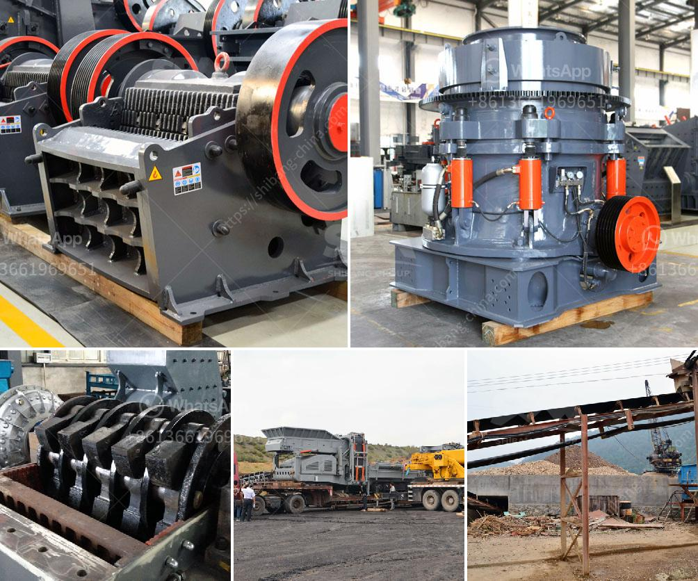

<h3>tracked crushers for sale south africa</h3>
Mining is an integral industry in South Africa, with several minerals being extracted from the ground in abundance. Mining compounds the economic growth of the country, creating job opportunities and attracting foreign investments. In this pursuit, the need for reliable equipment becomes paramount, especially when it comes to aggregate production.

Aggregate, as a key component in construction and road building, is in high demand in the country. It is essential that companies have access to efficient and cost-effective machinery to ensure a steady supply of high-quality aggregate. Tracked crushers are an excellent solution that has gained popularity over the years, elegantly addressing this need.

Tracked crushers are mobile crushing plants that utilize tracks rather than wheels for a smoother, more efficient operation. They have a distinct advantage over wheeled crushers, particularly in South Africa, where the terrain can be challenging. The tracks provide excellent traction and maneuverability, allowing these crushers to access remote locations with ease.

One of the key benefits of tracked crushers is their ability to produce a wide range of aggregate sizes. The crushing chambers in these machines can be adjusted, enabling operators to vary the output sizes to meet specific project requirements. This adaptability makes tracked crushers suitable for a broad spectrum of applications, from small-scale projects to large-scale mining operations.

Furthermore, tracked crushers are usually equipped with advanced features that enhance productivity and safety. Modern designs often incorporate remote-control operation, allowing workers to operate the crusher from a safe distance. This feature not only improves safety but also reduces downtime and increases efficiency. Additionally, some tracked crushers include intelligent systems that automatically adjust the crusher settings based on the material properties, further optimizing the performance.

In South Africa, there are various options available when it comes to tracked crushers for sale. From large jaw crushers to high-performing cone crushers, these machines are efficient, durable, and highly productive. They are designed to meet the highest safety standards and can be easily transported to different sites.

When considering a tracked crusher, it is important to analyze certain factors. One crucial aspect is the capacity required for the specific project. Some tracked crushers are capable of processing hundreds of tons per hour, making them suitable for large-scale operations. On the other hand, smaller capacity crushers may be more suitable for smaller projects or companies.

The availability of spare parts and after-sales service is another essential consideration. Reputable manufacturers will ensure a steady supply of spare parts, reducing downtime and ensuring uninterrupted operation. Additionally, reliable after-sales service guarantees peace of mind, as experts are readily available to address any issues that may arise.

In conclusion, tracked crushers for sale in South Africa offer an ideal solution for aggregate producers seeking high-quality materials. These machines combine mobility, versatility, and advanced features, making them well-suited for various applications. With proper analysis of capacity requirements and consideration of reliable manufacturers, companies can select tracked crushers that will optimize their productivity, profitability, and contribute to the growth of South Africa's mining industry.
<h3>Contact us</h3><ul><li><strong>Whatsapp:&nbsp;<a href="https://wa.me/8613661969651">+8613661969651</a></strong></li><li><a href="https://swt.shibang-china.com/?git&amp;zhl&amp;tracked crushers for sale south africa"><strong>Online Service(chat now)</strong></a></li></ul><h3>Related</h3><ul><li><a href='200tph cone crusher.md'>200tph cone crusher</a></li><li><a href='calcium carbonate making machinery in germany.md'>calcium carbonate making machinery in germany</a></li><li><a href='used roller mill in kenya.md'>used roller mill in kenya</a></li><li><a href='production line for calcium carbonate.md'>production line for calcium carbonate</a></li><li><a href='american stone crusher price.md'>american stone crusher price</a></li></ul>