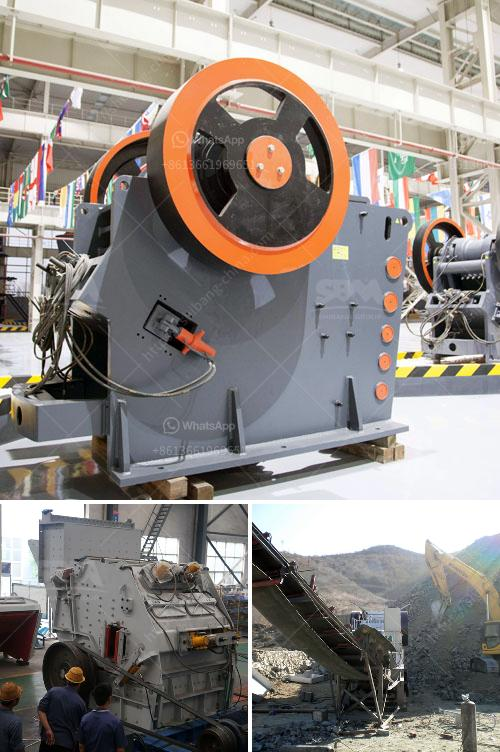

<h3>track-mounted mobile crusher</h3>
Track-mounted mobile crushers are versatile pieces of equipment that can be used for a variety of tasks. They are commonly used in aggregates production, recycling applications, and in mining operations. They are compact, flexible, and easily transportable on and off the job site.

One of the key benefits of a track-mounted mobile crusher is its mobility. With a track-mounted unit, you can rely on easy transportation and positioning of the equipment, allowing you to efficiently move it around the worksite as needed. This is particularly useful in situations where multiple crushing sites need to be serviced or if the crusher needs to be relocated frequently.

Another advantage of a track-mounted mobile crusher is its flexibility. These machines are designed to handle a wide range of materials, from soft to medium-hard rock and everything in between. This versatility makes them ideal for various applications, from construction and demolition waste recycling to quarrying and mining.

Track-mounted mobile crushers are equipped with a wide range of features to enhance performance and maximize productivity. From large feed openings and steep cavity profiles to aggressive crushing actions and high crushing forces, these machines are designed to deliver superior crushing performance and ensure optimal end-product shape.

Additionally, advanced automation features on track-mounted mobile crushers help to ensure efficient operation and high productivity. These features include automated process control, real-time monitorings, and remote control capabilities. Such features not only improve operational efficiency but also enhance safety for operators.

Another important aspect of track-mounted mobile crushers is their lower operating costs. These machines are designed to be fuel-efficient, which helps to reduce overall operating expenses. Additionally, the compact design of these crushers allows for easy transportation, resulting in lower transportation costs.

Maintenance and servicing of track-mounted mobile crushers are relatively easier compared to other types of crushers. These machines are designed with easy access to key components, such as the engine, hydraulic system, and other vital parts. This allows for quick and efficient maintenance, reducing downtime and increasing overall productivity.

In conclusion, track-mounted mobile crushers are versatile machines that offer a host of benefits for various applications. Their mobility, flexibility, and lower operating costs make them an attractive choice for contractors and operators alike. With their advanced features and automation capabilities, these crushers deliver high performance and help to achieve efficient and productive operations. Whether it's for recycling, quarrying, or mining, a track-mounted mobile crusher can be the perfect solution for your crushing needs.
<h3>Contact us</h3><ul><li><strong>Whatsapp:&nbsp;<a href="https://wa.me/8613661969651">+8613661969651</a></strong></li><li><a href="https://swt.shibang-china.com/?git&amp;zhl&amp;trackmounted mobile crusher"><strong>Online Service(chat now)</strong></a></li></ul><h3>Related</h3><ul><li><a href='tpd mini cement plant cost in india.md'>tpd mini cement plant cost in india</a></li><li><a href='roller mill in china.md'>roller mill in china</a></li><li><a href='plant machinery manufacturers in germany.md'>plant machinery manufacturers in germany</a></li><li><a href='vertical grinder mill for sale.md'>vertical grinder mill for sale</a></li><li><a href='small scale gold mining equipment in south africa.md'>small scale gold mining equipment in south africa</a></li></ul>