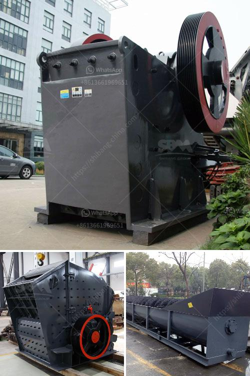

<h3>trommel screen suppliers in india</h3>
Trommel screens are essential equipment used in various industries for material separation and screening purposes. They are widely used in mining, construction, waste management, and recycling industries. In India, there are several trommel screen suppliers that cater to the diverse needs of these industries.

One prominent trommel screen supplier in India is Vijimech. With over 25 years of experience in the field, Vijimech has established itself as a reliable and trusted supplier of trommel screens. They offer a wide range of trommel screens that are designed to handle different types of materials and applications.

Vijimech trommel screens are known for their high-quality construction and efficient performance. They are made from robust materials that ensure durability and long-lasting performance even in harsh operating conditions. The screens are designed with precision to provide accurate and effective screening of materials.

Another notable trommel screen supplier in India is Star Trace. They offer trommel screens that are suitable for a wide range of applications such as sand, gravel, aggregates, mining, and recycling. The screens are designed with heavy-duty construction to withstand the demanding conditions of these industries.

Star Trace trommel screens are equipped with advanced features that enhance their performance and efficiency. They are easy to operate and maintain, making them a preferred choice for many customers. The screens are designed with customizable options to meet the specific requirements of different customers.

One of the leading trommel screen suppliers in India is ETA Engineering Services. They offer a comprehensive range of trommel screens that are used in diverse industries such as chemicals, food processing, agriculture, and pharmaceuticals. The screens are designed and manufactured using advanced technology to ensure high accuracy and efficiency in material separation.

ETA Engineering Services trommel screens are made from premium quality materials that provide excellent strength and durability. They are designed with precision to provide optimal screening performance. The screens are available in different sizes and configurations to cater to the specific needs of customers.

In conclusion, there are several trommel screen suppliers in India that offer high-quality and efficient screening solutions. These suppliers provide a wide range of trommel screens suitable for various industries. Vijimech, Star Trace, and ETA Engineering Services are some of the notable suppliers in India that have gained a reputation for their reliable and durable trommel screens. When investing in trommel screens, it is crucial to choose a supplier that understands your specific requirements and offers reliable and efficient screening solutions.
<h3>Contact us</h3><ul><li><strong>Whatsapp:&nbsp;<a href="https://wa.me/8613661969651">+8613661969651</a></strong></li><li><a href="https://swt.shibang-china.com/?git&amp;zhl&amp;trommel screen suppliers in india"><strong>Online Service(chat now)</strong></a></li></ul><h3>Related</h3><ul><li><a href='limestone crushing processing for the manufacture.md'>limestone crushing processing for the manufacture</a></li><li><a href='silica sand washing machine in south africa.md'>silica sand washing machine in south africa</a></li><li><a href='iron ore crusher machine.md'>iron ore crusher machine</a></li><li><a href='vibrating screen consumption.md'>vibrating screen consumption</a></li><li><a href='steel casting mining machinery parts wedge plate.md'>steel casting mining machinery parts wedge plate</a></li></ul>