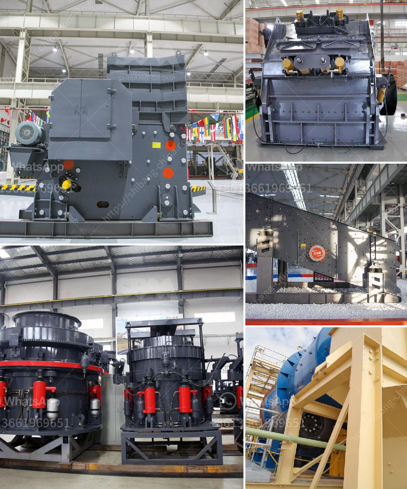

<h3>turkey cone crusher</h3>
Turkey has abundant mineral resources, especially in recent years with the infrastructure construction ongoing, mining industry become the focus of investment. We all know that the cone crusher is a kind of stone crushing equipment with good sales volume and wide application in the mining industry. We have Turkish clients who have had a positive cooperation with Fote company with its advanced cone crusher and the whole service.

The cone crusher is suitable for crushing hard and medium-hard materials, such as various ores, gypsum, refractory materials, and so on. Being more efficient, the Turkish cone crusher is perfect for high feed rates and obtaining a high percentage of cubic-shaped end products. Offering a favorable combination of capacity and product quality, it realizes rapid and flexible movements in the cone crusher market.

Today, the Turkish cone crusher has become widely used in the quarrying industry due to its high crushing efficiency, low operation cost, and easy maintenance. Furthermore, thanks to its large production capacity, it represents a high-quality choice for barite crushing applications. As Turkey's economy develops, the construction industry and mining machinery industry have a rapidly growing demand for cone crushers.

Turkey faces the challenge of increasing competition in the quarrying sector. To stand out from the competition and provide high-quality products to customers, manufacturers need to constantly improve the performance, efficiency, and technology of cone crushers. The Turkish cone crusher market is competitive, so manufacturers must regularly invest in research and development to provide new features to meet customer requirements and provide new products to increase their market share.

In conclusion, the Turkish cone crusher has been widely used in the mining industry, which successfully improves the operational efficiency of traditional crushing equipment and wins customer's trust and praise. The Turkish cone crusher has proven itself as a game-changer in the stone crushing industry, contributing to the economic development of Turkey.
<h3>Contact us</h3><ul><li><strong>Whatsapp:&nbsp;<a href="https://wa.me/8613661969651">+8613661969651</a></strong></li><li><a href="https://swt.shibang-china.com/?git&amp;zhl&amp;turkey cone crusher"><strong>Online Service(chat now)</strong></a></li></ul><h3>Related</h3><ul><li><a href='used h 6000 cone crushers for sale.md'>used h 6000 cone crushers for sale</a></li><li><a href='jaw crushing plants saudi.md'>jaw crushing plants saudi</a></li><li><a href='philippines stone crusher.md'>philippines stone crusher</a></li><li><a href='limestone crusher mining equipment.md'>limestone crusher mining equipment</a></li><li><a href='the process of belt conveyor.md'>the process of belt conveyor</a></li></ul>