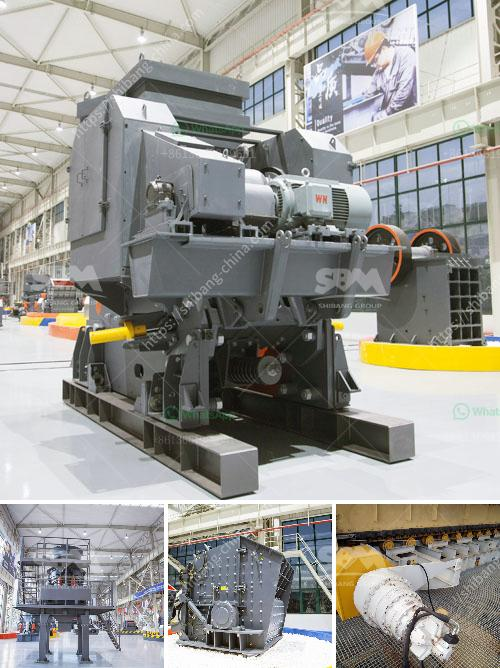

<h3>turkey project gypsum powder production line</h3>
Turkey is renowned for having a rich natural resource base and fertile land. In recent years, the country has initiated numerous projects aimed at utilizing these resources for economic growth and development. One such project that holds immense potential is the gypsum powder production line.

Gypsum, a naturally occurring mineral, has various uses in the construction and manufacturing industries. It is widely utilized in the production of plaster, wallboard, cement, and fertilizers. Turkey, possessing large deposits of gypsum, is well-positioned to capitalize on this valuable resource.

The gypsum powder production line is a project that integrates gypsum mining, grinding, drying, and calcination. It aims to produce high-quality gypsum powder for various purposes, such as plastering, construction, and agricultural applications. Utilizing state-of-the-art technology, the project promises to deliver superior-quality gypsum powder at reasonable prices.

The project involves setting up a gypsum mining site, followed by the installation of a crushing and grinding plant. The mined gypsum ore will undergo primary crushing, which typically includes jaw crushing. Afterward, it will be transported to the grinding mill for further processing.

In the grinding process, the gypsum ore will be ground into a fine powder, ensuring its uniformity and consistency. This step is crucial for enhancing the final product's properties and ensuring its suitability for various applications. Once the grinding process is complete, the gypsum powder will undergo drying, which removes any remaining moisture.

The dried gypsum powder will then enter the calcination process, where it will be heated at high temperatures to remove any remaining water molecules. This step is crucial for achieving the desired chemical composition and physical properties of the gypsum powder. After calcination, the final product will be carefully packaged for distribution.

The Turkey project gypsum powder production line boasts several advantages for the country's economy. Firstly, it will generate employment opportunities, creating jobs for mining workers, technicians, engineers, and plant operators. This will contribute to a reduction in unemployment and an overall improvement in the standard of living.

Secondly, the project will enhance Turkey's export potential. By producing high-quality gypsum powder, the country can cater to the growing demand for this essential material in the international market. This will lead to increased export revenues, promoting economic growth and reducing dependence on imports.

Furthermore, the gypsum powder production line will contribute to the country's construction sector. As Turkey experiences continuous urbanization and infrastructure development, the demand for gypsum-based products will undoubtedly rise. This project will ensure a stable supply of high-quality gypsum powder, supporting both residential and commercial construction activities.

Lastly, the project aligns with Turkey's commitment to sustainable development. Gypsum mining and production can be conducted in an environmentally responsible manner, minimizing any adverse effects on ecosystems. By adhering to stringent environmental regulations, the gypsum powder production line will ensure the protection of Turkey's natural resources and biodiversity.

In conclusion, the Turkey project gypsum powder production line holds tremendous potential for the country's economy and development. This initiative will not only utilize Turkey's rich gypsum resources but also create job opportunities, enhance export revenues, and support the construction sector. Additionally, the project's commitment to sustainability reinforces Turkey's efforts towards responsible resource management.
<h3>Contact us</h3><ul><li><strong>Whatsapp:&nbsp;<a href="https://wa.me/8613661969651">+8613661969651</a></strong></li><li><a href="https://swt.shibang-china.com/?git&amp;zhl&amp;turkey project gypsum powder production line"><strong>Online Service(chat now)</strong></a></li></ul><h3>Related</h3><ul><li><a href='stone crushing machines.md'>stone crushing machines</a></li><li><a href='machine layout gypsum board manufacturing.md'>machine layout gypsum board manufacturing</a></li><li><a href='crushing construction waste crusher.md'>crushing construction waste crusher</a></li><li><a href='mineral crusher processing plants china.md'>mineral crusher processing plants china</a></li><li><a href='raymond mill in india.md'>raymond mill in india</a></li></ul>