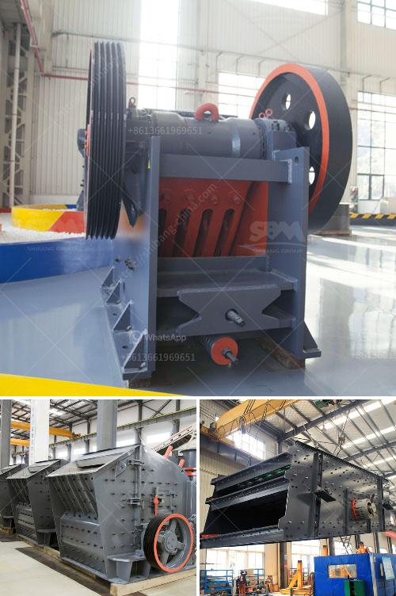

<h3>type of conveyors belt pdf</h3>
Conveyors are essential in a multitude of industries for moving items from one place to another. They are versatile and efficient, eliminating the need for manual labor and increasing productivity. One type of conveyor that has gained popularity in recent years is the belt conveyor. In this article, we will explore the different types of belt conveyors and their applications.

1. Flat Belt Conveyors: This type of conveyor uses a flat belt made of rubber, plastic, or fabric. The belt is supported by a series of rollers or pulleys, allowing it to move smoothly along a flat surface. Flat belt conveyors are commonly used in various industries, including manufacturing, food processing, and packaging. They are perfect for transporting items with a flat bottom surface, such as boxes, packages, and cartons.

2. Modular Belt Conveyors: Modular belt conveyors feature interlocking plastic or metal modules that form a continuous surface. These modules can be easily replaced if damaged, making maintenance simple and cost-effective. Modular belt conveyors are commonly used in industries where cleanliness and hygiene are crucial, such as pharmaceuticals, food processing, and beverage production.

3. Cleated Belt Conveyors: Cleated belt conveyors have vertical cleats or ribs on the surface of the belt, which prevent items from sliding down or falling off during transportation. They are primarily used for incline or decline applications, where items need to be transported up or down an incline. Cleated belt conveyors are commonly used in industries such as agriculture, mining, and construction.

4. Magnetic Belt Conveyors: Magnetic belt conveyors use magnets underneath the belt to hold and transport magnetic materials. These conveyors are commonly used in industries handling ferrous materials, such as metal fabrication, recycling, and manufacturing. The magnetic force ensures that items will not slide or shift during transportation, improving safety and efficiency.

5. Troughed Belt Conveyors: Troughed belt conveyors feature a flat or troughed belt supported by rollers or idlers. The shape of the belt allows for more efficient transportation of bulk materials or large items. Troughed belt conveyors are commonly used in industries such as mining, quarrying, and construction, for transporting materials such as coal, sand, gravel, and ores.

In conclusion, belt conveyors are a versatile and efficient solution for material handling in various industries. From flat belt conveyors for packaging applications to magnetic belt conveyors for handling ferrous materials, there is a type of conveyor to fit every need. When choosing a conveyor, it is essential to consider factors such as the type of material being transported, the required incline or decline, and any specific industry requirements. By selecting the appropriate conveyor, businesses can optimize their operations and enhance productivity.
<h3>Contact us</h3><ul><li><strong>Whatsapp:&nbsp;<a href="https://wa.me/8613661969651">+8613661969651</a></strong></li><li><a href="https://swt.shibang-china.com/?git&amp;zhl&amp;type of conveyors belt pdf"><strong>Online Service(chat now)</strong></a></li></ul><h3>Related</h3><ul><li><a href='dolomite stone crusher plant.md'>dolomite stone crusher plant</a></li><li><a href='cost of copper ore processing plant.md'>cost of copper ore processing plant</a></li><li><a href='total power for jaw crusher 500 tph.md'>total power for jaw crusher 500 tph</a></li><li><a href='how to ball mill magnesium.md'>how to ball mill magnesium</a></li><li><a href='vibrating sieve supplier in south africa.md'>vibrating sieve supplier in south africa</a></li></ul>