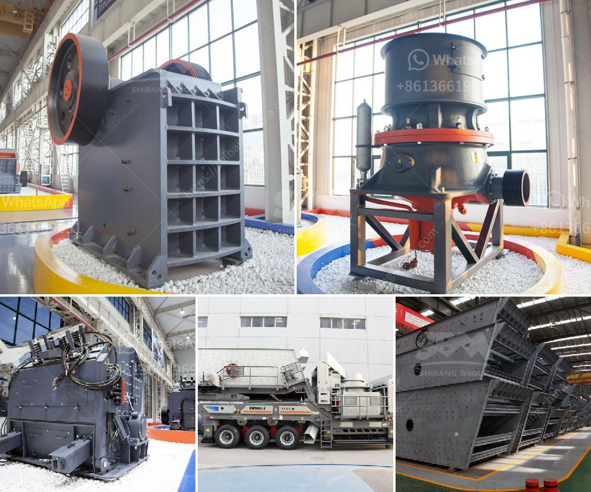

<h3>types of ball mill machine for gold</h3>
Gold is a kind of rare mineral resource in the nature after being extracted from common ores and comes with highly industrial value. With the development of technology, the sales volume of gold ore processing equipment has been gradually increased, so is in the demand of small ball mill in the market. What's more, the majority of clients are used to inquiring about a small ball mill of 2t/h for gold ore processing, according to research and projections.

As we all know, the ball mill is one of the common and efficient grinding equipment in mineral processing sector, which is widely applied to grind various ore and materials due to different characteristics of every ore. There are many types of ball mill available in the market for different industries. They are primarily used for fine grinding, which is only produced when the material reaches the designated sieve size.

The most common types of ball mill used in the gold ore grinding process are dry ball mill and wet ball mill. Nowadays, gold ore ball mill is mainly distributed in some developing countries, in these countries, plenty of small ball mill innovation, pursue technology innovation, and development, promote the development of small ball mill business. 

As the leading manufacturer of global mining machinery, SBM provides different types of ball mill machine for gold ore grinding plants. The mentioned gold ore ball mill is used to grind many kinds of mine and other materials, or to select the mine. It is widely used in building material, chemical industry, etc.

There are two ways of grinding: the dry process and the wet process. It can be divided into tabular type and flowing type according to the different forms of discharging material. The ball mill machine is widely used in the mining, construction, and chemical industries. However, the most common type of ball mill in the market is the overflow ball mill.

Overflow ball mill is suitable for grinding various ores and other materials. It is widely used in mineral processing, construction, and chemical industries. This type of ball mill can grind materials with different hardness, and it is suitable for grinding all kinds of ores and other materials. It also can be used for dry grinding and wet grinding.

On the other hand, the grate discharge ball mill is usually used in the first stage grinding, usually followed by overflow discharge ball mill, which has high efficiency and grid ball mill is suitable for grinding all kinds of ores and other materials. It is widely used in ore dressing plants, power plants, cement plants, and chemical plants.

In conclusion, the gold ore ball mill machine is available with different types for different customers, such as the small one, medium one, large one. Clients can choose the suitable types according to their actual needs. Gold ore ball mill machine can effectively reduce the noise level and prolong the service life of the equipment. With the global economic downturn, more and more gold investors prefer to diversify investment without risk. Therefore, the future of gold market is promising.
<h3>Contact us</h3><ul><li><strong>Whatsapp:&nbsp;<a href="https://wa.me/8613661969651">+8613661969651</a></strong></li><li><a href="https://swt.shibang-china.com/?git&amp;zhl&amp;types of ball mill machine for gold"><strong>Online Service(chat now)</strong></a></li></ul><h3>Related</h3><ul><li><a href='rotary grinder machine thailand.md'>rotary grinder machine thailand</a></li><li><a href='ball mill cost for 100ton cement plant.md'>ball mill cost for 100ton cement plant</a></li><li><a href='sell 150 tph stone crusher.md'>sell 150 tph stone crusher</a></li><li><a href='marble powder mill machinery.md'>marble powder mill machinery</a></li><li><a href='used small gold processing plant from dubai.md'>used small gold processing plant from dubai</a></li></ul>