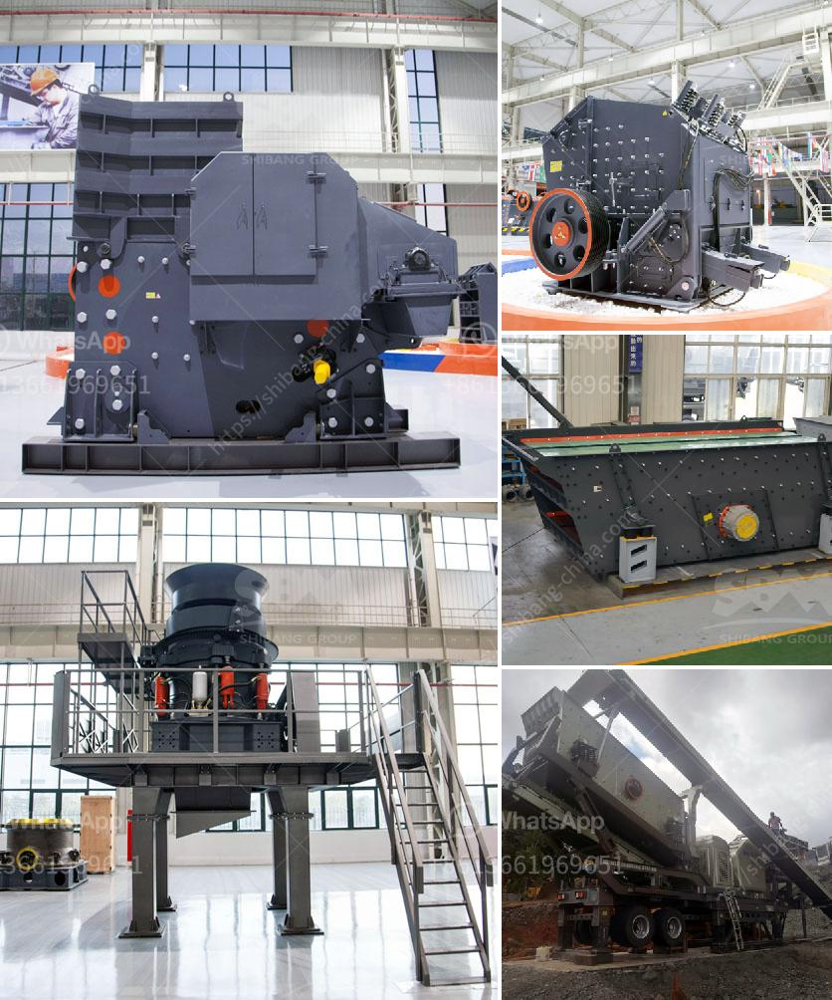

<h3>types of conveyors belts</h3>
Conveyor belts are widely used in various industries to transport goods, materials, and products efficiently and safely. They are an essential part of modern industrial automation systems. Conveyor belts, also known as conveyor systems, are typically made of a continuous loop of materials that rotate around two or more pulleys.

There are several types of conveyor belts available, each designed for specific purposes and applications. Below are some common types of conveyor belts used in various industries:

1. Flat Belt Conveyors: This type of conveyor belt consists of a wide belt that rotates on flat pulleys. They are used to transport both light and heavy materials, including food products, packages, and parts for assembly. Flat belt conveyors are ideal for industries such as retail, pharmaceutical, food processing, and packaging.

2. Cleated Belt Conveyors: These belts are equipped with vertical or horizontal cleats to help keep the transported materials in place during inclines and declines. Cleated belt conveyors are commonly used in industries that require transportation of products and materials at different angles, such as agricultural, recycling, and mining.

3. Modular Belt Conveyors: These belts are made of individual plastic modules that are interlocked together using hinge rods. They can be easily customized to fit various layouts and applications. Modular belt conveyors are suitable for transporting products in industries such as automotive, bottling, and warehouse distribution.

4. Magnetic Belt Conveyors: These belts use magnets to move ferrous materials, such as parts, cans, or chips, over a magnetic slide plate. They are commonly used in industries where product positioning and orientation are crucial, such as metal stamping, recycling, and sheet metal fabrication.

5. Roller Belt Conveyors: This type of conveyor belt uses a series of powered rollers to move goods or materials along the belt. Roller belt conveyors are commonly used in industries that require the transportation of heavy or bulky materials, including automotive, assembly lines, and warehousing.

6. Wire Mesh Belt Conveyors: These belts are made of interlinked metal wires and are commonly used in industries that involve high-temperature processes, such as baking and food drying. Wire mesh belt conveyors provide excellent ventilation and allow liquids or heat to pass through the belt.

7. Incline/Decline Belt Conveyors: As the name suggests, these conveyor belts transport materials either in an upward or downward direction. They are commonly used in industries such as mining, food processing, and manufacturing, where materials need to be transported to different levels of a facility.

Each type of conveyor belt has its unique advantages, disadvantages, and applications. It is essential to consider factors such as the weight, size, and type of materials being transported, as well as the environment and layout of the facility when selecting the appropriate conveyor belt.

In conclusion, conveyor belts play a critical role in modern industries by improving efficiency and safety in material handling and transportation. Understanding the different types of conveyor belts available can help businesses choose the most suitable option for their specific needs. Whether it's flat belts, cleated belts, modular belts, magnetic belts, roller belts, wire mesh belts, or incline/decline belts, there is a conveyor belt solution available for every industry.
<h3>Contact us</h3><ul><li><strong>Whatsapp:&nbsp;<a href="https://wa.me/8613661969651">+8613661969651</a></strong></li><li><a href="https://swt.shibang-china.com/?git&amp;zhl&amp;types of conveyors belts"><strong>Online Service(chat now)</strong></a></li></ul><h3>Related</h3><ul><li><a href='program to simulate conveyor belts.md'>program to simulate conveyor belts</a></li><li><a href='denver ball mills.md'>denver ball mills</a></li><li><a href='hammers mill machine.md'>hammers mill machine</a></li><li><a href='sand washing plant saudi arabia.md'>sand washing plant saudi arabia</a></li><li><a href='lime and dolomite plant division.md'>lime and dolomite plant division</a></li></ul>