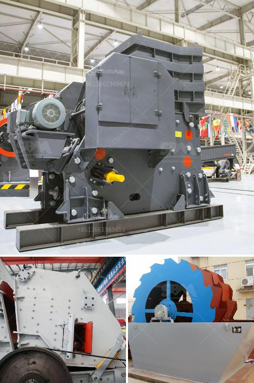

<h3>uk calcium carbonate grinding</h3>
Calcium carbonate is a widely used mineral in various industries, including construction, agriculture, and pharmaceuticals. In the United Kingdom, there is a growing demand for finely ground calcium carbonate, as it provides numerous benefits in various applications. In this article, we will explore the process of calcium carbonate grinding in the UK and its significance in different sectors.

The grinding process of calcium carbonate involves the use of a specialized mill that grinds the mineral down to a fine powder. The machine, known as a grinding mill, utilizes mechanical energy to efficiently grind the calcium carbonate into a uniform size. This finely ground powder is then used in a wide range of applications.

One of the primary areas where calcium carbonate grinding is used in the UK is in the construction industry. The finely ground calcium carbonate acts as a filler material in cement, adding strength and durability to the final product. It also enhances the workability of cement, making it easier to handle during construction. The use of calcium carbonate in construction not only improves the quality of the materials but also reduces the overall cost, making it an economical choice.

In agriculture, calcium carbonate grinding plays a crucial role as well. The finely ground powder acts as a soil amendment, providing essential nutrients to the soil. Calcium carbonate is rich in calcium, a vital element for plant growth and development. By incorporating ground calcium carbonate into the soil, farmers can improve its pH level and nutrient content, thus enhancing crop productivity. Additionally, it helps in mitigating the effects of soil acidification caused by excessive use of fertilizers.

The pharmaceutical industry in the UK also extensively utilizes calcium carbonate powder. It is used as an active ingredient in various medications, such as antacids and calcium supplements. Calcium carbonate acts as an antacid by neutralizing excess stomach acid, providing relief from conditions like heartburn and indigestion. It is also an essential nutrient for maintaining healthy bones and teeth, making it a key component in calcium supplements.

The process of grinding calcium carbonate in the UK involves stringent quality control measures. The manufacturers ensure that the final product meets the required standards by conducting extensive testing on the ground powder. This includes assessing particle size, purity, and chemical composition to ensure optimal performance in different applications.

Moreover, the grinding process itself has seen advancements in recent years. Technological innovations have led to the development of more efficient grinding mills, enhancing the productivity of calcium carbonate grinding in the UK. These modern mills offer better control over particle size distribution and have improved energy efficiency, reducing both costs and environmental impact.

In conclusion, calcium carbonate grinding plays a vital role in various industries in the United Kingdom. The finely ground powder is extensively used in construction, agriculture, and pharmaceuticals, offering numerous benefits in each sector. As technology continues to advance, the process of grinding calcium carbonate is becoming more efficient and environmentally friendly, contributing to the sustainable development of the UK industries that rely on this versatile mineral.
<h3>Contact us</h3><ul><li><strong>Whatsapp:&nbsp;<a href="https://wa.me/8613661969651">+8613661969651</a></strong></li><li><a href="https://swt.shibang-china.com/?git&amp;zhl&amp;uk calcium carbonate grinding"><strong>Online Service(chat now)</strong></a></li></ul><h3>Related</h3><ul><li><a href='total power for jaw crusher 500 tph.md'>total power for jaw crusher 500 tph</a></li><li><a href='buyers ball mill process.md'>buyers ball mill process</a></li><li><a href='grinding machine for making fine powder.md'>grinding machine for making fine powder</a></li><li><a href='coal mining equipment manufacturers in south africa.md'>coal mining equipment manufacturers in south africa</a></li><li><a href='raymond mill micro pulverizer.md'>raymond mill micro pulverizer</a></li></ul>