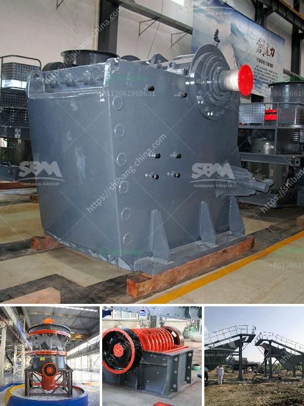

<h3>usa stone crushing machines manufacturers</h3>
In recent years, the stone crushing machinery market in the USA has experienced significant growth due to the increasing demand for a variety of construction materials like gravel, limestone, and granite. As a result, the market is flooded with various stone crushing machines manufacturers who provide high-quality machines to meet the growing needs of the industry.

One of the leading manufacturers in the USA is MB Crusher. They offer a wide range of machines specifically designed for the demolition and recycling industry, including jaw crushers, impact crushers, drum cutters, and screening buckets. These machines are known for their durability, efficiency, and versatility, making them popular choices among construction professionals.

Another prominent player in the industry is Eagle Crusher. They specialize in manufacturing a wide range of heavy-duty crushing and screening equipment, including cone crushers, impact crushers, and jaw crushers. These machines are widely used in the mining, quarrying, and recycling industries, and are known for their reliability and performance.

Astec Industries is another notable stone crushing machines manufacturer in the USA. They manufacture a wide range of equipment for the mining, quarrying, and asphalt industries, including portable jaw crushers, cone crushers, and impact crushers. Their machines are known for their high productivity and low maintenance requirements.

Overall, the stone crushing machines manufacturers in the USA are committed to providing high-quality equipment to meet the demanding needs of the industry. With a wide range of machines available, construction professionals can find the right equipment for their specific needs. Whether it is crushing, screening, or recycling, these manufacturers offer reliable and efficient solutions to ensure the success of every project. So, if you are in need of stone crushing machinery, look no further than the manufacturers in the USA.
<h3>Contact us</h3><ul><li><strong>Whatsapp:&nbsp;<a href="https://wa.me/8613661969651">+8613661969651</a></strong></li><li><a href="https://swt.shibang-china.com/?git&amp;zhl&amp;usa stone crushing machines manufacturers"><strong>Online Service(chat now)</strong></a></li></ul><h3>Related</h3><ul><li><a href='crusher machine for feldspar.md'>crusher machine for feldspar</a></li><li><a href='jaw crusher plant.md'>jaw crusher plant</a></li><li><a href='sand washinng plant makers in srilanka.md'>sand washinng plant makers in srilanka</a></li><li><a href='lm vertical grinding mill.md'>lm vertical grinding mill</a></li><li><a href='fuel consumption of stone crushers.md'>fuel consumption of stone crushers</a></li></ul>