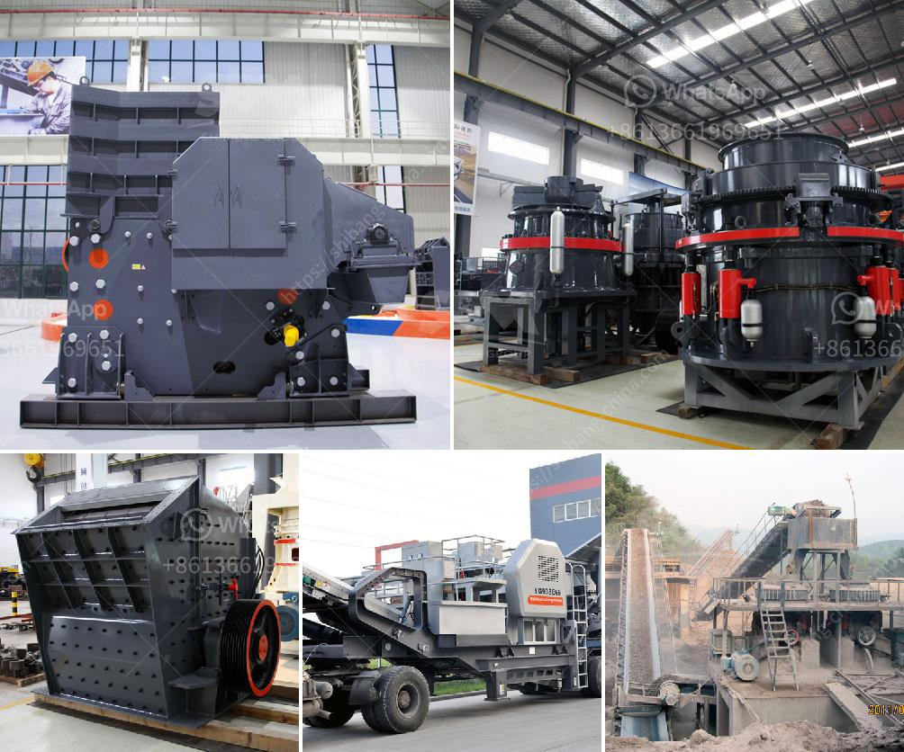

<h3>usa used equipment grinding mill minerals 3 tph 200 mesh</h3>
The grinding and processing of minerals play a significant role in various industries, such as mining, agriculture, and construction. To meet the growing demands of these industries, specialized equipment is required. In the USA, used equipment, such as grinding mills, presents an opportunity for businesses to maximize productivity while reducing costs. This article explores the benefits and features of a used equipment grinding mill capable of achieving desired results with a mesh size of 200 and a 3 TPH capacity. 

With the advancement in technology, businesses often dispose of older machinery to make room for newer, more advanced equipment. However, machinery that is no longer utilized by one business can find a second life through resale and purchase. Used equipment, such as grinding mills, offers several advantages for buyers, including lower costs and immediate availability. 

One such used equipment option in the USA is a grinding mill designed for processing minerals. This particular grinding mill operates with a capacity of 3 TPH (tons per hour) and an impressive mesh size of 200. Its efficient design allows for the grinding of various minerals, including limestone, quartz, and feldspar, among others. This grinding mill is renowned for its ability to produce consistently fine particle sizes required in many industries. 

1. Cost-effective: Purchasing used equipment eliminates the high price associated with new machinery. The investment in a used grinding mill saves businesses a substantial amount of capital, allowing for increased budget allocation in other areas of operation.

2. Immediate availability: When opting for a used equipment grinding mill, businesses can enjoy immediate availability. Instead of waiting for a new mill to be manufactured and delivered, a used mill can be acquired quickly, reducing downtime and maximizing productivity.

3. Excellent performance: The reliability and efficiency of this used grinding mill allow for consistent production of a wide range of particle sizes. The 200-mesh capability ensures the uniformity and fineness required by specific industries.

4. Reduced maintenance costs: Used equipment usually undergoes thorough inspection and refurbishment to ensure optimal performance. Investing in a well-maintained grinding mill reduces the need for immediate maintenance, minimizing associated costs.

5. Sustainability: By purchasing used equipment, businesses contribute to a more sustainable economy. Extending the life of machinery through reuse reduces the need for new manufacturing, ultimately reducing the ecological footprint.

Used equipment grinding mills for minerals offer a cost-effective and efficient solution for businesses in need of reliable machinery. This particular grinding mill, capable of a mesh size of 200 and a capacity of 3 TPH, presents an attractive option for those seeking to enhance productivity while minimizing costs. By investing in used equipment, businesses can achieve their desired processing capabilities, ensure the consistent production of fine particle sizes, and contribute to a more sustainable future.
<h3>Contact us</h3><ul><li><strong>Whatsapp:&nbsp;<a href="https://wa.me/8613661969651">+8613661969651</a></strong></li><li><a href="https://swt.shibang-china.com/?git&amp;zhl&amp;usa used equipment grinding mill minerals 3 tph 200 mesh"><strong>Online Service(chat now)</strong></a></li></ul><h3>Related</h3><ul><li><a href='small cement plant for sale.md'>small cement plant for sale</a></li><li><a href='crusher machine for sale kenya.md'>crusher machine for sale kenya</a></li><li><a href='granite feeding equipment manufacturer.md'>granite feeding equipment manufacturer</a></li><li><a href='ball mill grinding micronizer.md'>ball mill grinding micronizer</a></li><li><a href='stone quarry machines.md'>stone quarry machines</a></li></ul>