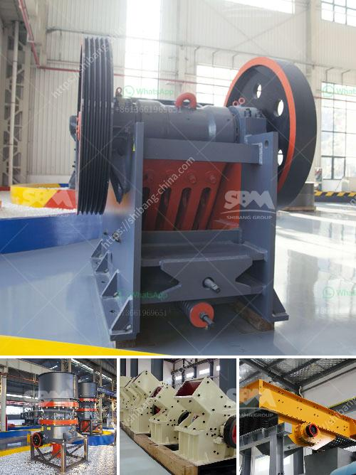

<h3>usd jaw crusher in turkey</h3>
The usage of jaw crushers in Turkey has seen a significant increase over the years. These machines are primarily utilized in the mining industry, where they are essential in breaking down large rocks into smaller, more manageable sizes for further processing. One model that has gained immense popularity in Turkey is the USD jaw crusher.

The USD jaw crusher is a versatile machine that can be used for a variety of applications. It is an ideal choice for primary crushing as it offers high reduction ratios and a large feed opening. This ensures that even the hardest and toughest materials can be efficiently crushed.

One of the reasons why the USD jaw crusher is highly favored in Turkey is its impressive performance. It boasts a robust construction, ensuring durability and reliability, even under the most demanding conditions. Additionally, it is equipped with advanced features that enhance productivity and ease of operation. These include a hydraulic toggle system, which provides optimum jaw adjustment and protects the crusher from overload, and a wide range of jaw plate options, allowing users to customize the machine to suit their specific needs.

Furthermore, the USD jaw crusher is known for its low operating costs. It consumes less energy and requires minimal maintenance, making it a cost-effective choice for Turkish businesses. Its simple design also facilitates easy and quick replacement of wear parts, minimizing downtime and maximizing productivity.

In conclusion, the USD jaw crusher has gained a strong foothold in the Turkish market, thanks to its exceptional performance, durability, and cost-effectiveness. As the demand for high-quality aggregates continues to grow in Turkey, these machines will undoubtedly play a pivotal role in meeting the country's construction needs.
<h3>Contact us</h3><ul><li><strong>Whatsapp:&nbsp;<a href="https://wa.me/8613661969651">+8613661969651</a></strong></li><li><a href="https://swt.shibang-china.com/?git&amp;zhl&amp;usd jaw crusher in turkey"><strong>Online Service(chat now)</strong></a></li></ul><h3>Related</h3><ul><li><a href='uk calcium carbonate grinding.md'>uk calcium carbonate grinding</a></li><li><a href='stone crushing business estimate.md'>stone crushing business estimate</a></li><li><a href='used quarry machine germany.md'>used quarry machine germany</a></li><li><a href='mobile screen and crushing.md'>mobile screen and crushing</a></li><li><a href='sand manufacturing machine price in tamilnadu.md'>sand manufacturing machine price in tamilnadu</a></li></ul>