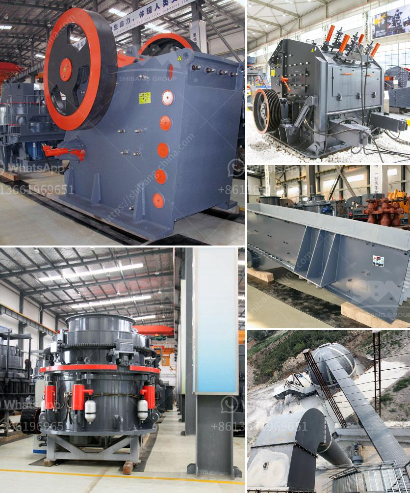

<h3>use of the ball mill</h3>
The ball mill is a key equipment for grinding materials, widely used in powder-making production line such as cement, silicate sand, new-type building material, refractory material, fertilizer, ore dressing of ferrous metal and non-ferrous metal, glass ceramics, etc. Ball mill can grind various ores and materials with dry type or wet type.

The ball mill is a versatile grinding tool, which is capable of grinding various types of material into fine powder. These ball mills are often controlled by a machine that feeds materials through one end of the mill and out the other end. Smaller mills can only operate with the help of a cylindrical container containing a tight ball charge (usually steel). Larger mills are often run at slightly lower speed than the smaller ones, but still produce the same amount of output. 

One of the advantages of using ball mills is the relatively low capital cost. These mills can easily be purchased or rented, and it takes less time and money to move them from one location to another. Additionally, they require less initial investment than many other grinding equipment options, making them a great choice for newcomers to the mining industry.

Furthermore, the ball mill offers various benefits compared to other grinding equipment. Firstly, it produces a narrow particle size distribution, which is beneficial for further grinding. Secondly, it operates at a low noise level, making it ideal for use in a crowded laboratory or production environment. Lastly, the ball mill is highly efficient, reducing the amount of energy required to grind material, resulting in substantial savings in energy costs.

In conclusion, the ball mill is a versatile and efficient grinding tool, which is capable of grinding various types of material into fine powder. It offers several benefits over other grinding equipment options including low capital cost, narrow particle size distribution, low noise level, and high efficiency. Its versatility and cost-effectiveness make it a popular choice for both small-scale and large-scale grinding operations across a range of industries.
<h3>Contact us</h3><ul><li><strong>Whatsapp:&nbsp;<a href="https://wa.me/8613661969651">+8613661969651</a></strong></li><li><a href="https://swt.shibang-china.com/?git&amp;zhl&amp;use of the ball mill"><strong>Online Service(chat now)</strong></a></li></ul><h3>Related</h3><ul><li><a href='turkey project gypsum powder production line.md'>turkey project gypsum powder production line</a></li><li><a href='magnesium carbonate plant layout.md'>magnesium carbonate plant layout</a></li><li><a href='jaw crusher price.md'>jaw crusher price</a></li><li><a href='stone crushing business plan.md'>stone crushing business plan</a></li><li><a href='concrete crushing equipment price.md'>concrete crushing equipment price</a></li></ul>