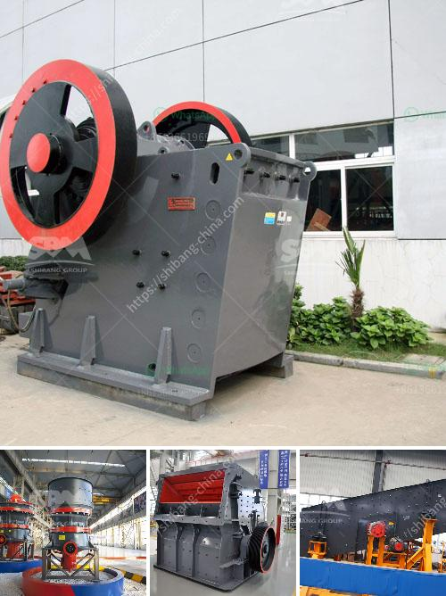

<h3>used aggregate crushing plant for sale</h3>
Are you in need of an aggregate crushing plant? Are you looking to purchase a used one at an affordable price? Well, you're in luck! In this article, we will be discussing the benefits of purchasing a used aggregate crushing plant and how it can save you money.

Firstly, let's understand what an aggregate crushing plant is. An aggregate crushing plant is used to produce various sizes of crushed stone for construction purposes. Among these sizes are gravel, sand, and ballast. This type of plant can be used for primary, secondary, and tertiary crushing to ensure the final product meets the required specifications.

Now, let's dive into the benefits of buying a used aggregate crushing plant. The most significant advantage is the cost savings. Used plants are generally more affordable compared to new ones, as the depreciation value has already occurred. With a used plant, you can get the same level of functionality and efficiency at a fraction of the price.

Moreover, buying a used aggregate crushing plant also offers a quicker turnaround time. Unlike new plants, which may take several months to manufacture and deliver, used plants are readily available. This means you can start using the plant immediately after purchase, saving you valuable time and enabling you to meet project deadlines without any delays.

In addition to cost savings and faster availability, used aggregate crushing plants have generally been well-maintained by previous owners. Reliable sellers ensure that the plant is in good working condition before putting it up for sale. As a result, you can expect a used plant to deliver the same level of performance and quality as a new one.

However, before finalizing your purchase, it is important to thoroughly inspect the used plant. Check for any signs of wear and tear, and ensure that all components are in proper working order. This will help you avoid any unexpected maintenance costs or downtime in the future.

When browsing for a used aggregate crushing plant, consider reaching out to reputable dealers or sellers. They have extensive knowledge and experience in the industry, allowing them to provide reliable information and guidance. Additionally, they can offer warranties or service contracts to give you peace of mind during the early stages of ownership.

To wrap up, purchasing a used aggregate crushing plant can be a cost-effective and efficient solution for your construction needs. Not only will it save you money, but it can also provide a quick turnaround time and reliable performance. Remember to thoroughly inspect the plant before finalizing your purchase and consult with reputable sellers to ensure a smooth transaction.

So, if you're in the market for an aggregate crushing plant, consider exploring the options available for used plants. With the benefits they offer, you can achieve your construction goals while keeping your budget in check.
<h3>Contact us</h3><ul><li><strong>Whatsapp:&nbsp;<a href="https://wa.me/8613661969651">+8613661969651</a></strong></li><li><a href="https://swt.shibang-china.com/?git&amp;zhl&amp;used aggregate crushing plant for sale"><strong>Online Service(chat now)</strong></a></li></ul><h3>Related</h3><ul><li><a href='gold wash plant trommel for sale in dubai.md'>gold wash plant trommel for sale in dubai</a></li><li><a href='crushing plant thailand.md'>crushing plant thailand</a></li><li><a href='movable gravel crusher.md'>movable gravel crusher</a></li><li><a href='jual jaw crusher 400 x.md'>jual jaw crusher 400 x</a></li><li><a href='screw conveyor blade calculation.md'>screw conveyor blade calculation</a></li></ul>