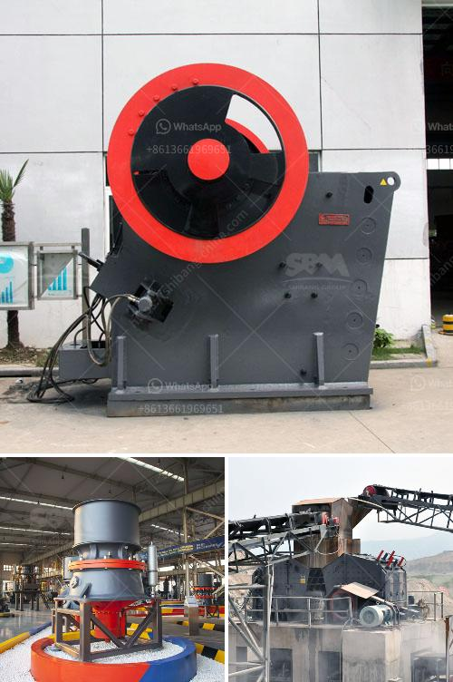

<h3>used air classifier mills for sale</h3>
In the competitive world of manufacturing and processing industries, finding cost-effective solutions for size reduction is crucial. Air classifier mills provide a versatile and efficient method for reducing particle size and are widely used in various industries such as pharmaceuticals, chemicals, food, and minerals. For companies looking to invest in size reduction equipment, opting for used air classifier mills for sale can be a smart choice.

Used equipment offers several advantages over new machinery, especially when it comes to cost. Investing in a brand-new air classifier mill can be a significant expense, particularly for small to medium-sized businesses. However, the market for used machinery provides an affordable alternative without compromising on quality or efficiency. By purchasing a second-hand air classifier mill, companies can save a substantial amount of money while still acquiring a reliable and high-performing machine.

When selecting a used air classifier mill, it is essential to choose a trustworthy supplier who offers machines that are in good condition and meet all necessary quality standards. Reputable suppliers often conduct thorough inspections and necessary repairs before listing their products for sale. This ensures that the used equipment is in proper working order, allowing businesses to start using it immediately without worrying about unexpected breakdowns or maintenance issues.

Another advantage of opting for used air classifier mills is the shorter lead time for delivery. Unlike brand-new machines that may require weeks or even months for production and shipping, used equipment is readily available and can be delivered quickly. This faster turnaround time can be especially beneficial for companies with urgent production requirements or those aiming to minimize downtime during equipment replacement.

In summary, used air classifier mills offer an affordable and reliable solution for businesses seeking size reduction equipment. By choosing a trusted supplier, companies can acquire a properly functioning machine that meets their specific production needs. Additionally, the shorter delivery time associated with used machinery ensures that production can resume promptly, minimizing downtime and maximizing productivity. With these benefits in mind, investing in used air classifier mills becomes an attractive option for those looking to optimize their manufacturing processes and reduce costs.
<h3>Contact us</h3><ul><li><strong>Whatsapp:&nbsp;<a href="https://wa.me/8613661969651">+8613661969651</a></strong></li><li><a href="https://swt.shibang-china.com/?git&amp;zhl&amp;used air classifier mills for sale"><strong>Online Service(chat now)</strong></a></li></ul><h3>Related</h3><ul><li><a href='sand dry vacuum machine truk.md'>sand dry vacuum machine truk</a></li><li><a href='list of crushers companies in malaysia.md'>list of crushers companies in malaysia</a></li><li><a href='old jaw crusher for sale in kenya.md'>old jaw crusher for sale in kenya</a></li><li><a href='cost a stone crusher.md'>cost a stone crusher</a></li><li><a href='coal wash plant for sale in malaysia.md'>coal wash plant for sale in malaysia</a></li></ul>