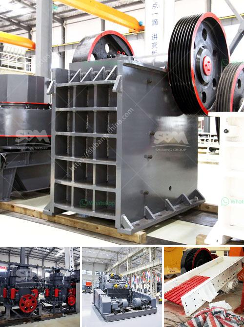

<h3>used ball mill for sale india</h3>
Are you in the market for a used ball mill? India is a vast and diverse country with a booming industrial sector. Whether you are a large-scale manufacturing company or a small start-up, investing in a used ball mill can save you money and allow you to make the most of your resources.

A ball mill is a cylindrical device used to grind materials like ores, chemicals, ceramic raw materials, and paints. Ball mills rotate around a horizontal axis, partially filled with the material to be ground plus the grinding medium. The different materials used in ball mills include stainless steel balls, ceramic balls, and flint pebbles.

There are several advantages to purchasing a used ball mill in India. Firstly, it is a cost-effective option compared to buying a brand-new one. Used ball mills are often significantly cheaper, allowing you to acquire the equipment you need without breaking the bank. Secondly, used ball mills are readily available on the market, meaning you can find one quickly and efficiently.

India is known for its manufacturing capabilities, and the second-hand market is thriving. You can find used ball mills from reputable sellers, both online and offline. It is essential to research the seller's reputation and ensure that the equipment is in good working condition before making a purchase.

When buying a used ball mill in India, it is crucial to consider your specific requirements. Think about the materials you will be processing, the required capacity, and the desired output size. This information will help you determine the right type and size of ball mill for your needs.

In conclusion, if you are looking to invest in a ball mill in India, opting for a used one can be a wise decision. It allows you to save money, access high-quality equipment, and make the most of your resources. Just make sure to do your homework, research reputable sellers, and thoroughly inspect the equipment before making a final purchase. Good luck!
<h3>Contact us</h3><ul><li><strong>Whatsapp:&nbsp;<a href="https://wa.me/8613661969651">+8613661969651</a></strong></li><li><a href="https://swt.shibang-china.com/?git&amp;zhl&amp;used ball mill for sale india"><strong>Online Service(chat now)</strong></a></li></ul><h3>Related</h3><ul><li><a href='the best crusher machines.md'>the best crusher machines</a></li><li><a href='calcium carbonate powder processing plant.md'>calcium carbonate powder processing plant</a></li><li><a href='mobile crusher and screening plant.md'>mobile crusher and screening plant</a></li><li><a href='stone crusher kenya.md'>stone crusher kenya</a></li><li><a href='buy jaw crushers.md'>buy jaw crushers</a></li></ul>