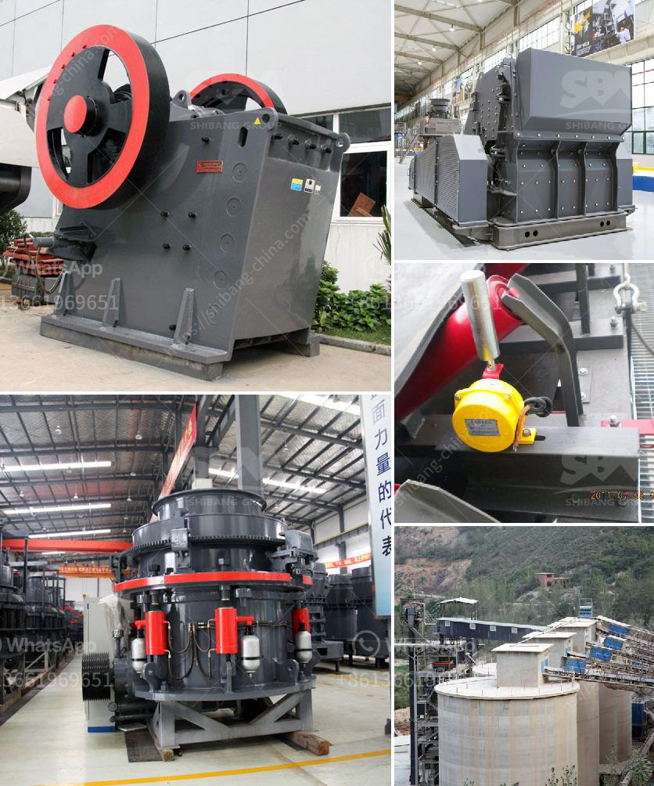

<h3>used basalt stone crusher price in uae</h3>
Basalt is a volcanic rock that forms when lava solidifies on the surface of the earth. Basalt stone is commonly used as an aggregate for construction projects such as road surfaces, concrete manufacturing, and various infrastructure projects. With the rapid development of urbanization in the United Arab Emirates (UAE), high-quality building materials are in high demand. As a result, the used basalt stone crusher price in UAE is on the rise.

Basalt has excellent properties such as compression resistance, crushing value, and good texture. These properties make it a suitable material for road construction and concrete production. The UAE government and private companies have invested heavily in infrastructure development projects, creating a substantial demand for basalt stone crushers.

The used basalt stone crusher price in UAE has various advantages. The crusher machine is equipped with advanced crushing technology and features a high degree of automation. The crushing chamber ensures the operation continuity and efficiency. Advanced crushing technology can reduce noise, vibration, and dust pollution, and improve the overall production environment. Moreover, the crusher machine has a simple structure, reliable performance, and convenient maintenance, which reduces downtime and improves production efficiency.

Another advantage of the used basalt stone crusher price in UAE is its environmental friendliness. The machine adopts a dust suppression system to minimize dust pollution during the production process. Additionally, the crusher machine uses energy-saving motors, reducing energy consumption and emissions. The UAE government places great emphasis on environmental protection and sustainable development, and the use of basalt stone crushers aligns with their goals.

The used basalt stone crusher price in UAE is also affected by factors such as regional supply and demand. In the UAE, the demand for basalt stone is growing. Consequently, the price of basalt stone in this region is higher than that of other regions. With the increasing popularity of basalt stone in the construction industry, the demand is expected to continue growing, further driving up the price.

In conclusion, the used basalt stone crusher price in UAE is advantageous for many factors. It offers advanced technology, high efficiency, environmental friendliness, and a promising market outlook. As the UAE government continues to invest in infrastructure projects, the demand for basalt stone crushers will likely continue to rise. Therefore, it is a wise choice for investors to consider investing in the used basalt stone crusher market in the UAE.
<h3>Contact us</h3><ul><li><strong>Whatsapp:&nbsp;<a href="https://wa.me/8613661969651">+8613661969651</a></strong></li><li><a href="https://swt.shibang-china.com/?git&amp;zhl&amp;used basalt stone crusher price in uae"><strong>Online Service(chat now)</strong></a></li></ul><h3>Related</h3><ul><li><a href='gravel making equipment.md'>gravel making equipment</a></li><li><a href='copper ore crushing plant brazil.md'>copper ore crushing plant brazil</a></li><li><a href='small diesel engine crusher from tanzania.md'>small diesel engine crusher from tanzania</a></li><li><a href='method statement of installation conveyor belt.md'>method statement of installation conveyor belt</a></li><li><a href='sand washing plant saudi arabia.md'>sand washing plant saudi arabia</a></li></ul>