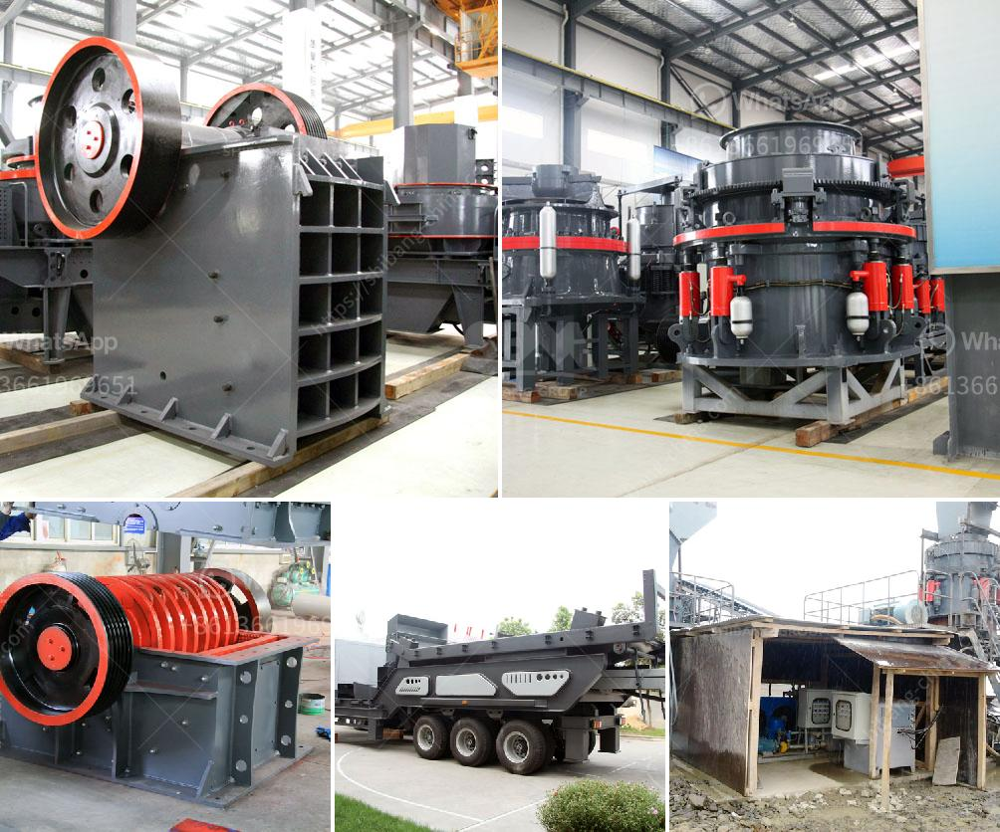

<h3>used concrete crushing plant for sale in uae</h3>
The concrete crusher is suitable for handling brittle materials. The main purpose of the concrete crusher is to break the concrete blocks into small pieces that can be transported and used for various construction purposes. The crushing machine serves as an efficient solution for breaking rocks, bricks, concrete, asphalt, and other materials into manageable sizes. In the UAE, there are many concrete crushers available for sale.

Concrete crushers for sale have many different types, such as mobile crushers, jaw crushers, cone crushers, impact crushers for sale in the UAE. When the concrete crusher is used, the motor drives the belt and the pulley, and moves the movable jaw up and down through the eccentric shaft. The angle between the toggle plate and the movable jaw becomes larger, which pushes the movable jaw plate to approach the fixed jaw plate, thus crushing the materials effectively. After being crushed, the crushed materials can be used in construction projects.

In the UAE, the market for concrete crushers is expanding rapidly. In particular, the sales volume of used concrete crushers for sale in the UAE has been increasing. The reasons why used concrete crushers for sale in the UAE are favored by many entrepreneurs are as follows.

First, the used concrete crusher is not expensive, compared with the new one. Therefore, most of the customers who need crushing equipment prefer to buy used concrete crushers.

Second, the operating condition of the used concrete crusher is very good. As the seller states, it has been used for several years but has been operating fully qualified. The best-selling concrete crusher in the UAE market includes cone crusher and jaw crusher.

Third, the third reason, the supporting equipment is needed in the UAE concrete crusher, which is very time-consuming and difficult to purchase. It requires specialist technicians and a considerable amount of time.

Fourth, the transportation problem is directly related to the cost and location of the project when selecting the machine. For example, the UAE has a tight construction development schedule, which means it needs a lot of concrete equipment, and the local buyers prefer products with less transportation distance because otherwise the delivery cost will increase substantially.

Fifth, it is the new building materials, construction waste crushing, the development of wear-resistant materials to protect the patent, and the equipment to solve the noise pollution and other factors, the advanced technology to optimize the competitiveness of enterprises.

The sale of used concrete crushers in the UAE is very popular and has attracted the attention of many investors. The UAE is one of the world's leading producers of oil and gas. The government plans to diversify the economy and reduce dependence on oil. To this end, the UAE government has actively introduced various measures to support the mining industry, including the development and sale of used concrete crusher machines in the UAE.

Overall, the sale of used concrete crushers in the UAE is an attractive option in construction machinery trading, especially with the current boom in the UAE construction industry. The demand for quality equipment is growing, accentuating the need for high-quality crushers.

In conclusion, used concrete crushers for sale in the UAE offer advanced technical advantages compared with similar products on the market. As we all know, the UAE’s economic development is accelerating, and the UAE’s construction machinery market is also booming. Therefore, the market for used concrete crushers for sale in the UAE is expansive, making it a hot-selling product with high potential profits.
<h3>Contact us</h3><ul><li><strong>Whatsapp:&nbsp;<a href="https://wa.me/8613661969651">+8613661969651</a></strong></li><li><a href="https://swt.shibang-china.com/?git&amp;zhl&amp;used concrete crushing plant for sale in uae"><strong>Online Service(chat now)</strong></a></li></ul><h3>Related</h3><ul><li><a href='double stage hammer crusher for stone.md'>double stage hammer crusher for stone</a></li><li><a href='mobile crusher malaysia for sell.md'>mobile crusher malaysia for sell</a></li><li><a href='mini cement plant project cost.md'>mini cement plant project cost</a></li><li><a href='ball mill liners manufacturers.md'>ball mill liners manufacturers</a></li><li><a href='manufacturer of limestone process.md'>manufacturer of limestone process</a></li></ul>