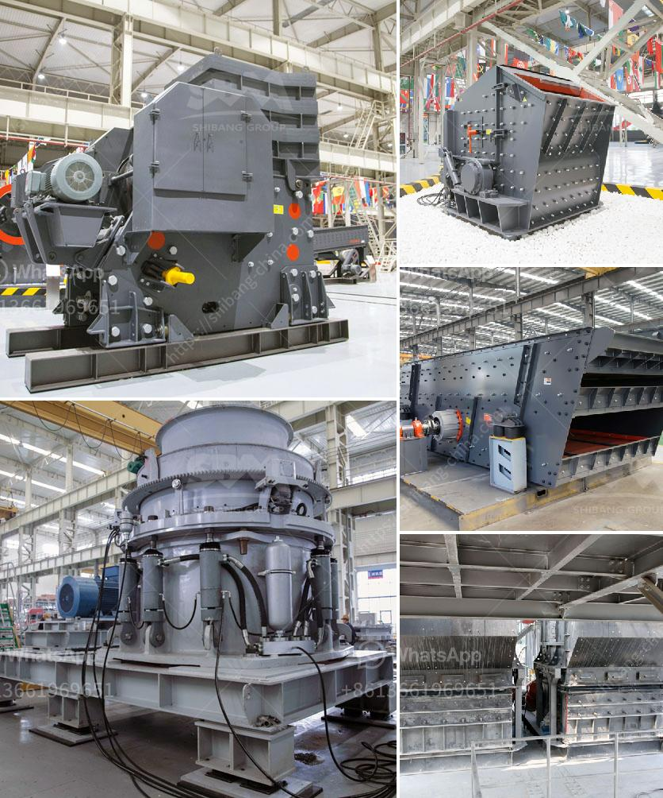

<h3>used crusher machine germany</h3>
Germany is renowned across the globe for its engineering prowess and technological advancements. When it comes to machinery and equipment, German products are considered to be of the highest quality. One such example is the used crusher machine Germany has to offer. These machines are known for their durability, efficiency, and reliability.

Used crusher machines in Germany are widely used for various industries including mining, construction, metallurgy, chemical industry, and many more. These machines come in various forms such as jaw crusher, gyratory crusher, cone crusher, roll crusher, hammer mills, impact crushers, and more. Each of these types utilizes different crushing principles and technologies to create high-quality crushed materials.

One of the advantages of opting for a used crusher machine in Germany is the cost-effective nature. These machines come at a significantly lower price compared to brand new ones while still offering similar performance. Moreover, German engineering ensures that even used machines are in excellent condition, making them a reliable investment.

Another benefit is the wide range of options available. Germany has a strong industrial base and a thriving used machinery market, where you can find crushers from various manufacturers. This means you can find a machine that exactly meets your requirements and specifications.

Furthermore, used crusher machines from Germany are known for their longevity. German engineering is known for its precision and attention to detail. These machines are built to withstand harsh working conditions and are often still operational after several years of use.

In conclusion, opting for a used crusher machine Germany is a wise choice for anyone in need of a high-quality and cost-effective crushing solution. With their durability, efficiency, and reliability, these machines offer excellent value for money. Whether it is for mining, construction, or any other industry, a used crusher machine from Germany will not disappoint.
<h3>Contact us</h3><ul><li><strong>Whatsapp:&nbsp;<a href="https://wa.me/8613661969651">+8613661969651</a></strong></li><li><a href="https://swt.shibang-china.com/?git&amp;zhl&amp;used crusher machine germany"><strong>Online Service(chat now)</strong></a></li></ul><h3>Related</h3><ul><li><a href='rock crusher plans.md'>rock crusher plans</a></li><li><a href='stone crusher for sale.md'>stone crusher for sale</a></li><li><a href='sand and gravel exploration equipment.md'>sand and gravel exploration equipment</a></li><li><a href='lime and dolomite plant division.md'>lime and dolomite plant division</a></li><li><a href='industrial mineral silica sand.md'>industrial mineral silica sand</a></li></ul>