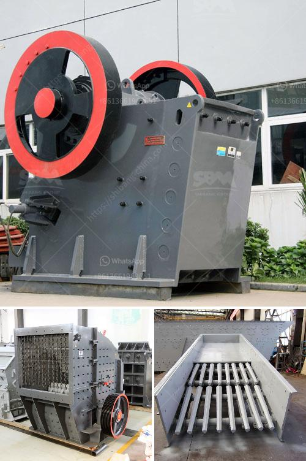

<h3>used crusher plants canada</h3>
Canada is known for its vast landscape, rich natural resources, and thriving mining industry. As a result, there is a constant demand for reliable and efficient crushing equipment in the country. Used crusher plants have quickly become a popular solution for businesses seeking cost-effective and sustainable crushing solutions.

One of the significant advantages of opting for used crusher plants in Canada is their affordable price point. Compared to buying brand new equipment, used crusher plants offer businesses substantial savings without compromising on quality. This is especially crucial for smaller companies operating on tighter budgets or contractors looking to expand their fleet without breaking the bank.

Additionally, used crusher plants in Canada also provide businesses with a wide range of options to suit their specific needs. With numerous makes, models, and configurations available, businesses can find the perfect crusher plant that aligns with their unique requirements. From jaw crushers and cone crushers to impact crushers and screens, there is a used crusher plant to tackle any size of operation or material.

Another advantage of used crusher plants in Canada is their availability. As mining and construction activity continues to grow across the country, there is a steady supply of used equipment in the market. This means businesses have access to a variety of crusher plants, allowing them to find the right equipment at the right time.

Furthermore, opting for used crusher plants promotes sustainability and environmental responsibility. By giving used equipment a second life, businesses contribute to reducing waste and minimizing their carbon footprint. This aligns with the growing global trend of practicing circular economy principles in various industries, including mining and construction.

In conclusion, used crusher plants in Canada provide businesses with affordable and efficient crushing solutions. With their lower price tags compared to new equipment, wide range of available options, and positive environmental impact, these plants are an attractive choice for companies looking to enhance their crushing capabilities. As the demand for crushing equipment continues to rise, used crusher plants offer a sustainable and cost-effective alternative for businesses across Canada.
<h3>Contact us</h3><ul><li><strong>Whatsapp:&nbsp;<a href="https://wa.me/8613661969651">+8613661969651</a></strong></li><li><a href="https://swt.shibang-china.com/?git&amp;zhl&amp;used crusher plants canada"><strong>Online Service(chat now)</strong></a></li></ul><h3>Related</h3><ul><li><a href='stone crusher for sale.md'>stone crusher for sale</a></li><li><a href='bentonite pulverizer ball mill in philippines.md'>bentonite pulverizer ball mill in philippines</a></li><li><a href='cone crusher that is a cone crusher.md'>cone crusher that is a cone crusher</a></li><li><a href='cost to open a mini cement plant.md'>cost to open a mini cement plant</a></li><li><a href='large scale mining vs small scale mining.md'>large scale mining vs small scale mining</a></li></ul>