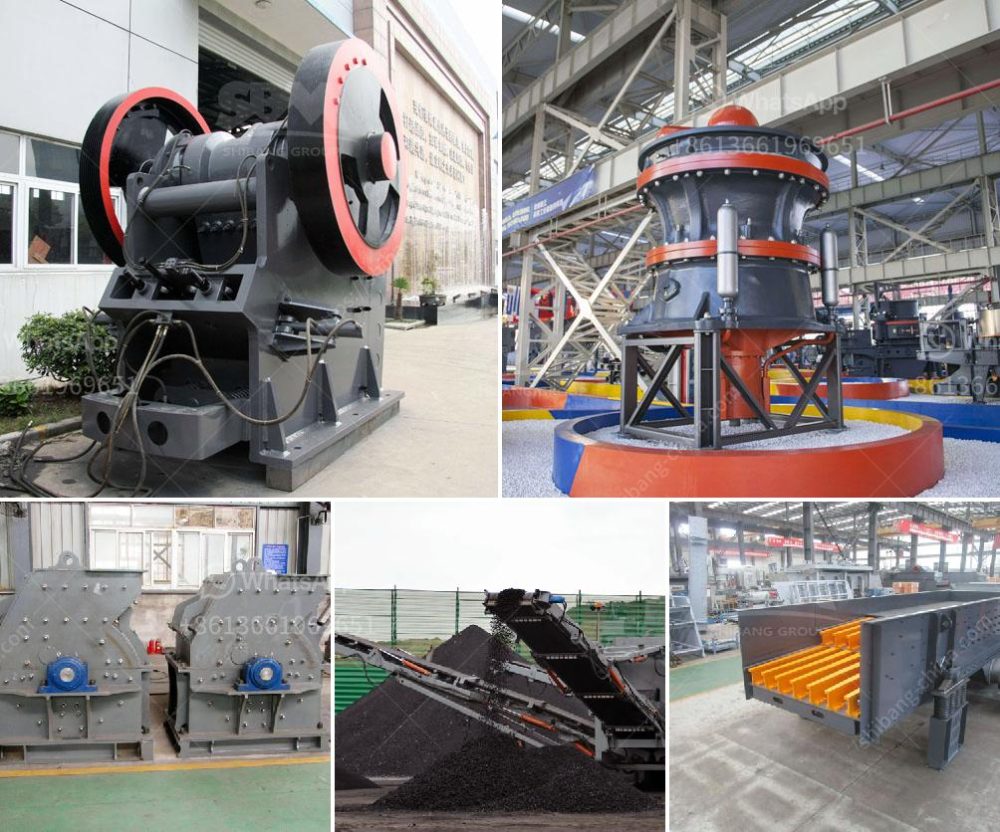

<h3>used equipment cement for sale</h3>
In the ever-evolving construction industry, cement is not just an essential building material, but a symbol of durability and strength. It forms the foundation upon which architects and engineers weave their visions into reality. However, the acquisition of brand new cement equipment can put a financial strain on companies of all sizes. This is where exploring the potential of used equipment cement for sale comes into play. From cost-effectiveness to reliability, let's dive deeper into the advantages of investing in used cement equipment.

One of the primary reasons why businesses opt for used equipment cement is its cost-effectiveness. New cement equipment can be immensely expensive, particularly for small and medium-sized enterprises (SMEs) or startups. By purchasing used equipment, companies can significantly reduce their initial expenditure and allocate those savings towards other critical areas of their operations.

While the idea of purchasing used equipment may raise concerns about reliability, it is crucial to remember that construction equipment is designed to withstand rigorous use. Many pieces of cement equipment retain their functionality and structural integrity even after years of operation. Careful inspection, maintenance, and seeking reputable sources for used equipment cement can provide businesses with reliable machinery that aligns with their requirements.

Unlike the limited choices often available for new cement equipment, the market for used equipment offers a wide variety of options. This includes mixers, pumps, conveyors, batching plants, and other machinery required for cement production. The extensive selection of used equipment allows businesses to tailor their purchases to suit their specific needs, ensuring they find the right machinery at the right price.

Choosing used equipment cement also promotes a sustainable approach to construction. By reducing the demand for new production, businesses actively contribute to reducing the environmental impact associated with manufacturing and mining raw materials. Furthermore, extending the lifecycle of machinery before disposal helps minimize waste and resource consumption.

The used equipment market is often supported by experienced sellers who understand the industry's demands. These sellers are generally well-versed in the equipment they offer, ensuring a smooth purchasing process. Additionally, reputable sellers often provide customer assistance, including warranties, technical support, and spare parts, boosting the reliability and upkeep of the purchased machinery.

Investing in used equipment cement supports the circular economy concept, a sustainable model designed to maximize the value of resources while minimizing waste. By purchasing used cement equipment, businesses contribute to the lengthening of the lifespan of products, promote recycling, and reduce the need for new manufacturing, thus preserving natural resources and reducing carbon emissions.

Used equipment cement for sale offers numerous advantages to construction industry players. From cost-effectiveness and reliability to a wide variety of options and environmental benefits, these advantages make used equipment an attractive choice for businesses seeking to maximize their resources and contribute to a sustainable approach. By embracing the potential of used equipment cement, construction companies can achieve their goals without compromising on quality or their bottom line.
<h3>Contact us</h3><ul><li><strong>Whatsapp:&nbsp;<a href="https://wa.me/8613661969651">+8613661969651</a></strong></li><li><a href="https://swt.shibang-china.com/?git&amp;zhl&amp;used equipment cement for sale"><strong>Online Service(chat now)</strong></a></li></ul><h3>Related</h3><ul><li><a href='mobile aggregate crusher.md'>mobile aggregate crusher</a></li><li><a href='graphite production machinery.md'>graphite production machinery</a></li><li><a href='manganese crusher processing plant in india.md'>manganese crusher processing plant in india</a></li><li><a href='cec rock crushers for sale.md'>cec rock crushers for sale</a></li><li><a href='granulator jaw crusher hadfield.md'>granulator jaw crusher hadfield</a></li></ul>