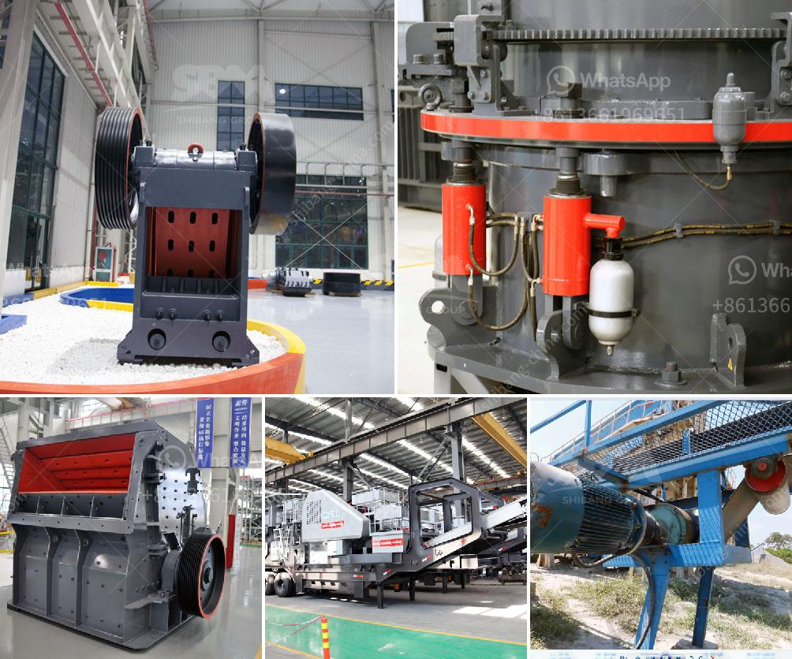

<h3>used h 6000 cone crushers for sale</h3>
A cone crusher is a primary crusher used in mining or ore processing. It reduces large chunks of raw material into smaller and manageable sizes. They are widely used in aggregates production, recycling applications, and mining operations. One popular model is the H6000 cone crusher, also known as the CH660.

The H6000 cone crusher is known for its relatively small size and great performance. It features an intelligent control system that monitors and optimizes crusher performance, ensuring it operates at its highest efficiency. With a maximum feed size of 235mm and a capacity range of 195-600 tph, it is suitable for various crushing applications. Its compact design and minimal moving parts make it easy to maintain and operate.

If you are in the market for a used H6000 cone crusher, there are several factors to consider. Firstly, the condition of the equipment should be thoroughly inspected. Check for any signs of wear and tear, damage, or corrosion. Look for any leaks or irregularities in the functioning of the machine. It is always recommended to request a detailed inspection report from the seller to ensure transparency.

Secondly, the usage history of the cone crusher should be verified. Ask for information about its previous applications and the type of materials it has been used to process. This will help you assess whether the equipment meets your specific requirements and if any modifications or additional equipment will be needed.

Thirdly, consider the price and timeframe for the purchase. Used equipment is generally more affordable compared to new ones, but it is crucial to evaluate the overall cost-effectiveness. Factor in any additional expenses such as transportation, installation, and potential repairs or upgrades. It is also important to establish a clear timeline for the acquisition to avoid any delays or disruptions to your operations.

Finding a reliable and reputable seller is crucial. Look for dealers or sellers who specialize in used mining equipment and have a strong reputation in the industry. They should provide you with all the necessary documentation and certifications related to the equipment, ensuring its authenticity and quality.

Online platforms and marketplaces are great resources for finding used H6000 cone crushers. You can search for available options, compare prices and specifications, and even contact sellers directly. However, it is advisable to physically inspect the equipment before making a final decision. Arrange a visit to the seller's location or request a video call to get a better understanding of the equipment's condition.

In conclusion, the H6000 cone crusher is a reliable and efficient piece of equipment used in various industries. When purchasing a used H6000 cone crusher, carefully inspect its condition, verify the usage history, and consider the price and timeframe for the purchase. It is also crucial to find a reputable seller who specializes in used mining equipment. With these considerations in mind, you can find a high-quality used H6000 cone crusher that meets your specific requirements and budget.
<h3>Contact us</h3><ul><li><strong>Whatsapp:&nbsp;<a href="https://wa.me/8613661969651">+8613661969651</a></strong></li><li><a href="https://swt.shibang-china.com/?git&amp;zhl&amp;used h 6000 cone crushers for sale"><strong>Online Service(chat now)</strong></a></li></ul><h3>Related</h3><ul><li><a href='conveyor belts in coal transport sizing.md'>conveyor belts in coal transport sizing</a></li><li><a href='schenck weighbelt feeders calibration procedure.md'>schenck weighbelt feeders calibration procedure</a></li><li><a href='mobile crushing and screening contractors south africa.md'>mobile crushing and screening contractors south africa</a></li><li><a href='used hammer mill crushers.md'>used hammer mill crushers</a></li><li><a href='the best crusher machines.md'>the best crusher machines</a></li></ul>