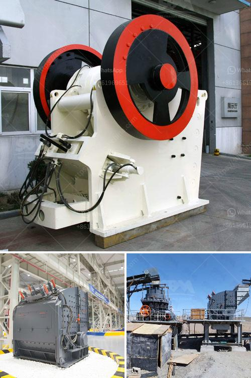

<h3>used hammer mill crushers</h3>
Used hammer mill crushers are an essential part of many industrial processes. As the name suggests, a hammer mill crusher is a machine used to crush or shred materials into smaller pieces. The basic design of this type of machine involves a rotating shaft to which free-swinging hammers are attached. When the material is fed into the chamber, it is struck by the hammers repeatedly until it is reduced to the desired size.

One of the main advantages of using a hammer mill crusher is its versatility. These machines can handle a wide range of materials, including coal, limestone, gypsum, and even wood. This makes them perfect for industries such as mining, construction, and manufacturing, where different types of materials need to be processed. Additionally, the adjustable hammer settings allow operators to control the size and consistency of the final product.

The efficiency of a hammer mill crusher is another notable feature. The rapid rotation of the hammers allows for continuous crushing, ensuring a high throughput rate. This means that large quantities of material can be processed in a relatively short amount of time. Furthermore, the ability to adjust the hammer settings and screen size enables operators to achieve the desired particle size for their specific application.

Used hammer mill crushers also offer cost savings compared to purchasing new equipment. Many companies prefer to invest in used machinery as it is often more affordable and readily available. However, it is crucial to choose a reputable seller who can provide reliable equipment that meets the required specifications. Regular maintenance and proper care are necessary to ensure the longevity and efficient operation of used hammer mill crushers.

In terms of safety, hammer mill crushers are generally considered safe to operate. However, operators must follow proper precautions and adhere to all safety guidelines. Protective measures, such as wearing appropriate personal protective equipment (PPE), ensuring the machine is properly grounded, and avoiding placing hands or other body parts near the hammers, are essential to prevent accidents.

While used hammer mill crushers offer numerous benefits, it is important to consider any potential drawbacks as well. These may include limited warranty coverage, the possibility of increased maintenance or repairs, and limitations in terms of newer technological advancements that may be missing in older models. Therefore, it is essential to carefully evaluate the specific requirements and expectations before investing in used machinery.

In conclusion, used hammer mill crushers are versatile machines that can efficiently crush a wide range of materials. Their high throughput rate, adjustable settings, and cost savings make them a popular choice in various industries. However, prospective buyers should thoroughly examine the condition and history of the equipment to ensure reliable performance. By doing so, they can enjoy the benefits of these machines, enhance their operational efficiency, and contribute to their overall business success.
<h3>Contact us</h3><ul><li><strong>Whatsapp:&nbsp;<a href="https://wa.me/8613661969651">+8613661969651</a></strong></li><li><a href="https://swt.shibang-china.com/?git&amp;zhl&amp;used hammer mill crushers"><strong>Online Service(chat now)</strong></a></li></ul><h3>Related</h3><ul><li><a href='gold stone crusher machine south africa.md'>gold stone crusher machine south africa</a></li><li><a href='lime powder machine.md'>lime powder machine</a></li><li><a href='aggregate crusher 200 meter capacity.md'>aggregate crusher 200 meter capacity</a></li><li><a href='cebu supplier of disposable jaw crusher.md'>cebu supplier of disposable jaw crusher</a></li><li><a href='roller mill price.md'>roller mill price</a></li></ul>