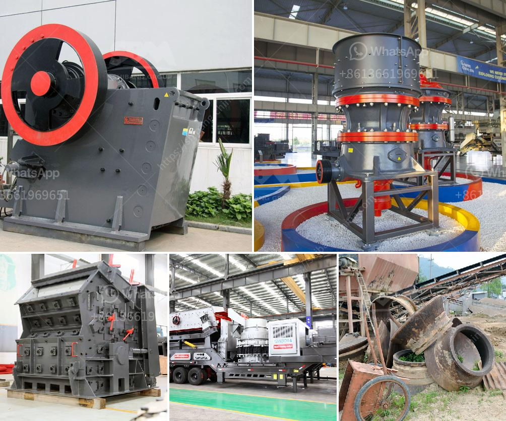

<h3>used hammer mill for sale in south africa</h3>
Are you in the market for a used hammer mill in South Africa? Are you looking to save money but still get a high-quality machine? Well, you're in luck because there are plenty of options available to you. In this article, we will explore the benefits of purchasing a used hammer mill and provide you with some tips on finding the perfect machine that fits your needs and budget.

One of the main advantages of buying a used hammer mill is cost savings. Used machinery is typically priced significantly lower than brand new equipment, making it an attractive option for budget-conscious buyers. By opting for a used machine, you can potentially save thousands of dollars while still getting a reliable and efficient hammer mill.

Another benefit of purchasing a used hammer mill is the reduced depreciation. When you buy a new machine, its value depreciates as soon as it leaves the showroom. However, with a used hammer mill, much of the depreciation has already occurred, meaning you won't experience the same level of value loss if you decide to sell it in the future.

Additionally, used hammer mills have often already been tested and proven effective in the field. Buying a used machine from a reputable seller ensures that you are getting a reliable piece of equipment that has been used and maintained properly. This can give you peace of mind, knowing that the machine has a track record of successful operation, reducing the risk of unexpected breakdowns or costly repairs.

To find a used hammer mill for sale in South Africa, you can search online or look in your local classifieds. Online platforms such as Gumtree and OLX offer a wide range of used hammer mills and other farming equipment for sale. You can browse through the listings, compare prices, and contact sellers directly to negotiate the best deal.

Before purchasing a used hammer mill, it's important to consider a few factors. Firstly, determine your specific requirements and the capacity you need. This will help you narrow down your options and find a machine that fits your needs. Secondly, inspect the machine thoroughly before making a purchase. Check for any signs of wear and tear, rust, or damage that may affect its performance. Lastly, ask for maintenance records or service history to ensure that the machine has been well-maintained and serviced regularly.

While buying a used hammer mill can be a great investment, it's crucial to do your due diligence and ensure you are purchasing from a reliable source. Look for reputable sellers with positive reviews and feedback from previous customers. Ask for references or testimonials if necessary.

In conclusion, purchasing a used hammer mill in South Africa can provide you with significant cost savings and a reliable machine for your farm or business. By following the tips mentioned above and conducting thorough research, you can find a high-quality used hammer mill that meets your needs and delivers excellent results. So, start your search today and make a smart investment in your agricultural endeavors.
<h3>Contact us</h3><ul><li><strong>Whatsapp:&nbsp;<a href="https://wa.me/8613661969651">+8613661969651</a></strong></li><li><a href="https://swt.shibang-china.com/?git&amp;zhl&amp;used hammer mill for sale in south africa"><strong>Online Service(chat now)</strong></a></li></ul><h3>Related</h3><ul><li><a href='tracked crushers for sale south africa.md'>tracked crushers for sale south africa</a></li><li><a href='production process of calcium carbonate.md'>production process of calcium carbonate</a></li><li><a href='micro fine grinding mill.md'>micro fine grinding mill</a></li><li><a href='simple gold mining machinery with prices.md'>simple gold mining machinery with prices</a></li><li><a href='rent a portable conveyor belt system malaysia.md'>rent a portable conveyor belt system malaysia</a></li></ul>