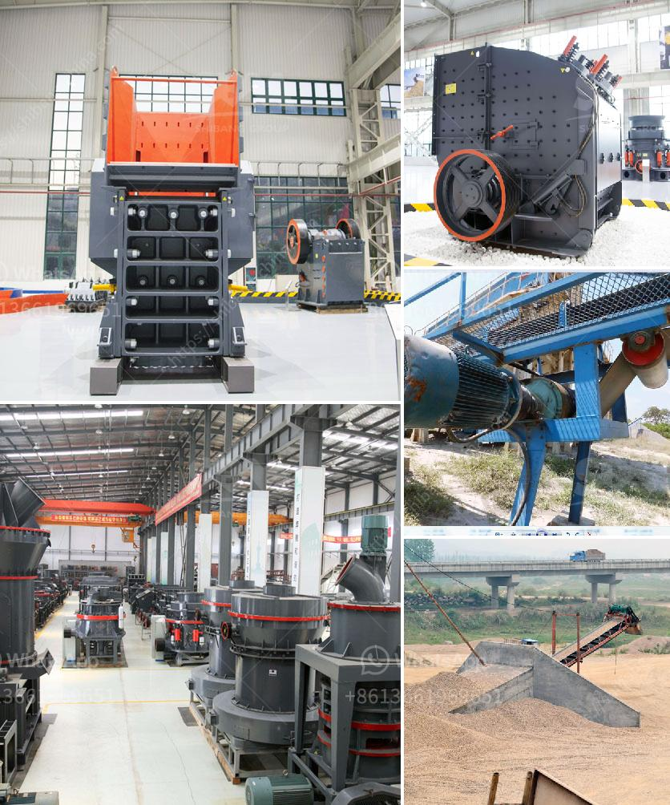

<h3>used industrial dryer for sale in india</h3>
Are you in the market for an industrial dryer? Consider exploring the option of purchasing a used industrial dryer in India. Used industrial dryers can offer numerous advantages, such as cost savings and immediate availability. As one of the leading countries in manufacturing and industrial capabilities, India is home to various opportunities for those seeking to purchase pre-owned industrial dryers.

One of the primary benefits of buying a used industrial dryer in India is the potential cost savings. Used equipment can often be obtained at a fraction of the price of a new dryer, allowing businesses to allocate their budget more efficiently. By purchasing a used dryer, you can acquire a high-quality piece of equipment without breaking the bank, enabling you to invest in other important aspects of your operations.

Furthermore, opting for a used industrial dryer allows for faster implementation. Unlike purchasing a new dryer, where you may have to wait for manufacturing and delivery, used dryers are readily available. Whether you are in urgent need of a replacement or looking to expand your production capacity, buying a pre-owned dryer ensures minimal downtime and maximum productivity.

In India, there is a wide range of options when it comes to used industrial dryers for sale. You can find various types of dryers, including rotary dryers, fluidized bed dryers, tray dryers, and more. With numerous manufacturers and suppliers offering used equipment, you have the opportunity to choose a dryer that meets your specific requirements and preferences.

Before making a purchase, it is crucial to consider a few factors to ensure a successful transaction. Firstly, assess the condition of the dryer thoroughly. Inspect the machinery, check for any signs of damage or wear, and inquire about the maintenance history. Requesting a trial run or demonstration can help ensure that the dryer functions optimally and meets your expectations.

Secondly, it is essential to source your used dryer from a reputable and reliable seller. Look for sellers or dealers with a good reputation in the market and positive customer reviews. By choosing a trustworthy seller, you can minimize the risk associated with purchasing used equipment and ensure a smooth buying experience.

Another factor to consider is the compatibility of the industrial dryer with your specific industry needs. Different industries have varying drying requirements, such as the desired temperature range, moisture removal capacity, and material compatibility. Understanding your industry's demands and selecting a dryer accordingly will ensure seamless integration into your production processes.

In conclusion, buying a used industrial dryer in India can offer numerous advantages, from cost savings to immediate availability. With the wide variety of options available and the country's robust manufacturing sector, there is no shortage of choices for businesses seeking pre-owned industrial dryers. However, it is essential to conduct thorough inspections, choose reputable sellers, and ensure compatibility with your industry's requirements. By following these guidelines, you can make a cost-effective and efficient investment in a used industrial dryer that will enhance your production capabilities.
<h3>Contact us</h3><ul><li><strong>Whatsapp:&nbsp;<a href="https://wa.me/8613661969651">+8613661969651</a></strong></li><li><a href="https://swt.shibang-china.com/?git&amp;zhl&amp;used industrial dryer for sale in india"><strong>Online Service(chat now)</strong></a></li></ul><h3>Related</h3><ul><li><a href='mobile crushing and screening.md'>mobile crushing and screening</a></li><li><a href='differences between jaw and gyratory crushers.md'>differences between jaw and gyratory crushers</a></li><li><a href='m sand crusher in district.md'>m sand crusher in district</a></li><li><a href='marble powder 100 mesh grinding machine.md'>marble powder 100 mesh grinding machine</a></li><li><a href='ball mills prices.md'>ball mills prices</a></li></ul>