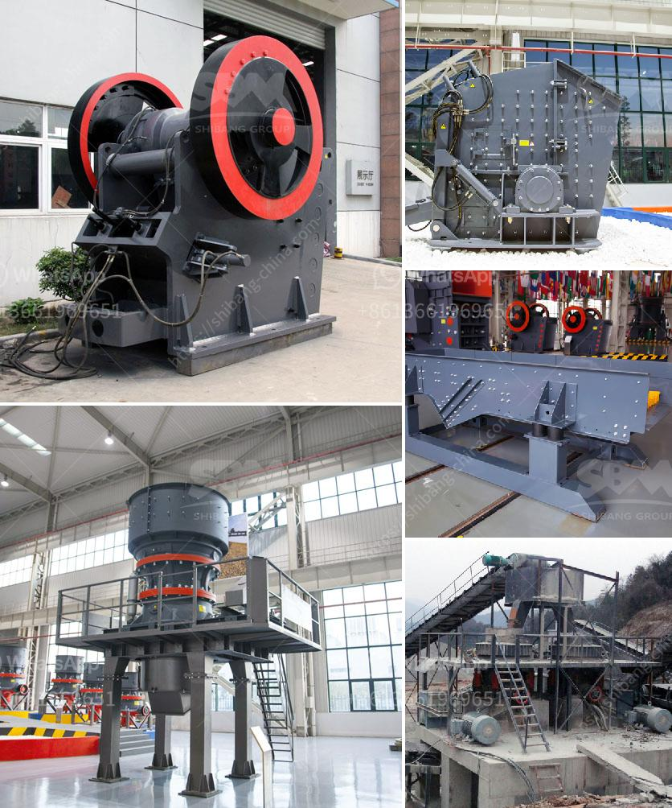

<h3>used jaw crusher for sale in zimbabwe</h3>
The mining industry is always on the lookout for new ways to improve efficiency and reduce costs. As crushers are essential in the process of breaking down rocks into smaller, more manageable sizes, investing in a used jaw crusher for sale in Zimbabwe can help in a number of ways.

By acquiring a reliable and versatile jaw crusher, users may be able to save on their operation costs. A reliable and flexible crusher will not only reduce the amount of downtime during maintenance but also optimize the production process by minimizing the need for manual intervention. This directly translates to lower labor costs and increased productivity.

Additionally, purchasing a used jaw crusher allows for a lower initial investment compared to buying a brand-new one. This can be particularly beneficial for smaller mining operations or those operating on a tight budget. However, it is important to thoroughly inspect the used crusher to ensure it is in good working condition before making a purchase. Consulting with a reputable equipment dealer or an experienced engineer can help identify any potential issues and assess the overall condition of the machine.

Furthermore, buying a used jaw crusher may also be a more sustainable option. Recycling and reusing equipment reduces the demand for new resources and minimizes the environmental impact associated with manufacturing and transportation. By giving a previously owned crusher a second life, mining companies can contribute to a more sustainable and responsible industry.

In conclusion, buying a used jaw crusher for sale in Zimbabwe can bring numerous benefits for mining companies. From reducing costs to promoting sustainability, a reliable and versatile crusher can significantly improve the efficiency of mining operations. However, it is important to carefully evaluate the condition of the used equipment to ensure its suitability for the specific application.
<h3>Contact us</h3><ul><li><strong>Whatsapp:&nbsp;<a href="https://wa.me/8613661969651">+8613661969651</a></strong></li><li><a href="https://swt.shibang-china.com/?git&amp;zhl&amp;used jaw crusher for sale in zimbabwe"><strong>Online Service(chat now)</strong></a></li></ul><h3>Related</h3><ul><li><a href='list of the price of crushing plant turkey.md'>list of the price of crushing plant turkey</a></li><li><a href='ballast processing machine.md'>ballast processing machine</a></li><li><a href='grinding ball mill philippines.md'>grinding ball mill philippines</a></li><li><a href='limestone powder machine in india.md'>limestone powder machine in india</a></li><li><a href='granite crusher supplier.md'>granite crusher supplier</a></li></ul>