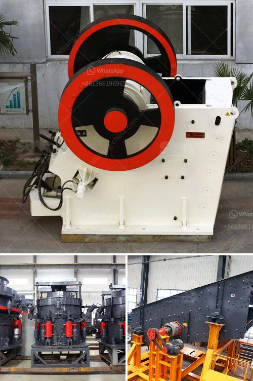

<h3>used korean made stone crusher</h3>
Stone crushing is an important process in various industries, including construction, mining, and road building. It is in high demand for its unique properties that can be used for a multitude of purposes. However, purchasing a brand-new stone crusher can be costly, especially for small businesses or individuals with limited budgets. This is where used Korean made stone crushers come into play, providing an affordable option for those in need.

Korea has a rich history of manufacturing top-quality crushers that have gained recognition worldwide. Known for their durability, reliability, and exceptional performance, Korean made stone crushers have become a preferred choice among many buyers. These crushers are designed to effectively break down the toughest stones, making them suitable for various applications.

The market for used Korean made stone crushers offers numerous advantages to potential buyers. Firstly, it is a cost-effective solution for those who cannot afford to invest in a new crusher. The used options are often available at a fraction of the original price, helping businesses save money while acquiring a reliable crushing machine.

Secondly, used stone crushers tend to be readily available on the market, ensuring a quick and convenient purchase process. This opens doors for entrepreneurs and small businesses to seize opportunities immediately without having to wait for long delivery periods.

Additionally, many used stone crushers are still in excellent condition, ensuring their functionality and operational efficiency. Korean manufacturers are known for their stringent quality control processes, so buyers can be confident in the durability and performance of these machines. Regular maintenance and servicing can further enhance their lifespan, making them a smart investment for the long term.

Furthermore, the availability of various models and specifications in the used Korean made stone crusher market allows buyers to find the perfect fit for their specific crushing needs. Whether one requires a small portable crusher for on-site projects or a larger stationary machine for larger-scale operations, there is a wide range of options to choose from.

In conclusion, used Korean made stone crushers offer an affordable alternative to buying new equipment. Besides being cost-effective, these crushers have a reputation for delivering exceptional performance. With a wide selection available and quick access to the market, businesses and individuals can easily find and purchase the perfect crusher for their requirements. So why spend more when you can get a reliable used stone crusher at a fraction of the cost?
<h3>Contact us</h3><ul><li><strong>Whatsapp:&nbsp;<a href="https://wa.me/8613661969651">+8613661969651</a></strong></li><li><a href="https://swt.shibang-china.com/?git&amp;zhl&amp;used korean made stone crusher"><strong>Online Service(chat now)</strong></a></li></ul><h3>Related</h3><ul><li><a href='grinding machine for making fine powder.md'>grinding machine for making fine powder</a></li><li><a href='3tph ball mill for gold ore processing.md'>3tph ball mill for gold ore processing</a></li><li><a href='nigeria hammer mill.md'>nigeria hammer mill</a></li><li><a href='how much does gold mining licences in nigeria.md'>how much does gold mining licences in nigeria</a></li><li><a href='conveyor belt manufacturer in saudi arabia.md'>conveyor belt manufacturer in saudi arabia</a></li></ul>