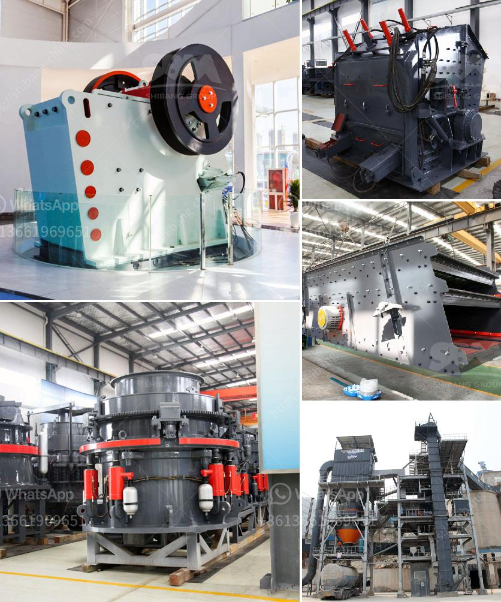

<h3>used limestone mill for sale in europe</h3>
Limestone is a sedimentary rock composed mainly of calcium carbonate (CaCO3), which is primarily used in the construction industry, particularly as a raw material for the production of Portland cement. Limestone is abundant across the globe and has been used for centuries in various applications, from architectural wonders like the Great Pyramids of Giza to modern infrastructure projects.

Europe, renowned for its rich architectural heritage and booming construction industry, is no stranger to the demand for limestone. However, with the increasing focus on sustainable development and the circular economy, there is now a growing push to reduce waste and maximize the use of available resources. This has opened up new opportunities for the sale of used limestone mills in Europe.

A limestone mill, also known as a limestone grinding mill, is a machine used to grind limestone into fine powder for various purposes, such as making cement and filling materials. As the market demand for limestone powder continues to grow, the used limestone mill provides a feasible solution to reduce both cost and environmental impact.

One of the key advantages of purchasing a used limestone mill is the significant cost savings compared to investing in a brand-new machine. The used market offers a range of options at competitive prices, depending on the condition, age, and specific requirements of the buyer. This presents a lucrative opportunity for entrepreneurs and construction companies looking to optimize their expenditure without compromising on quality.

Additionally, acquiring a used limestone mill promotes sustainability in the construction industry, contributing to the achievement of European Union (EU) targets for waste reduction and resource efficiency. By giving a second life to a previously owned machine, the purchase of a used limestone mill minimizes waste generation and carbon emissions associated with the manufacturing and transportation of new equipment.

Moreover, the availability of used limestone mills in Europe creates a localized market for buyers and sellers. This facilitates closer collaboration between businesses, stimulates the growth of the local economy, and reduces the dependence on imports from other continents. Supporting a thriving used machinery market promotes employment opportunities and helps retain valuable expertise within the region.

Another benefit of investing in a used limestone mill is the opportunity to evaluate the machine's performance through its previous usage history. This information allows buyers to make more informed decisions and ascertain the reliability and efficiency of the mill before making a purchase. By analyzing the machine's maintenance records, operators can plan their maintenance schedules and predict any potential issues, resulting in improved productivity and reduced downtime.

In conclusion, the sale of used limestone mills in Europe offers a win-win situation for both buyers and sellers. Buyers benefit from significant cost savings and contribute to sustainability goals, while sellers can monetize their underutilized assets and contribute to the circular economy. This trend not only supports economic growth but also promotes a more sustainable and efficient construction industry in Europe.
<h3>Contact us</h3><ul><li><strong>Whatsapp:&nbsp;<a href="https://wa.me/8613661969651">+8613661969651</a></strong></li><li><a href="https://swt.shibang-china.com/?git&amp;zhl&amp;used limestone mill for sale in europe"><strong>Online Service(chat now)</strong></a></li></ul><h3>Related</h3><ul><li><a href='marble grinder mill machine price in pakistan.md'>marble grinder mill machine price in pakistan</a></li><li><a href='clay mill machine crusher price.md'>clay mill machine crusher price</a></li><li><a href='mobile stone crusher 100 tph bangalore.md'>mobile stone crusher 100 tph bangalore</a></li><li><a href='usa stone crushing machines manufacturers.md'>usa stone crushing machines manufacturers</a></li><li><a href='stone crusher used machinery for sale in india.md'>stone crusher used machinery for sale in india</a></li></ul>