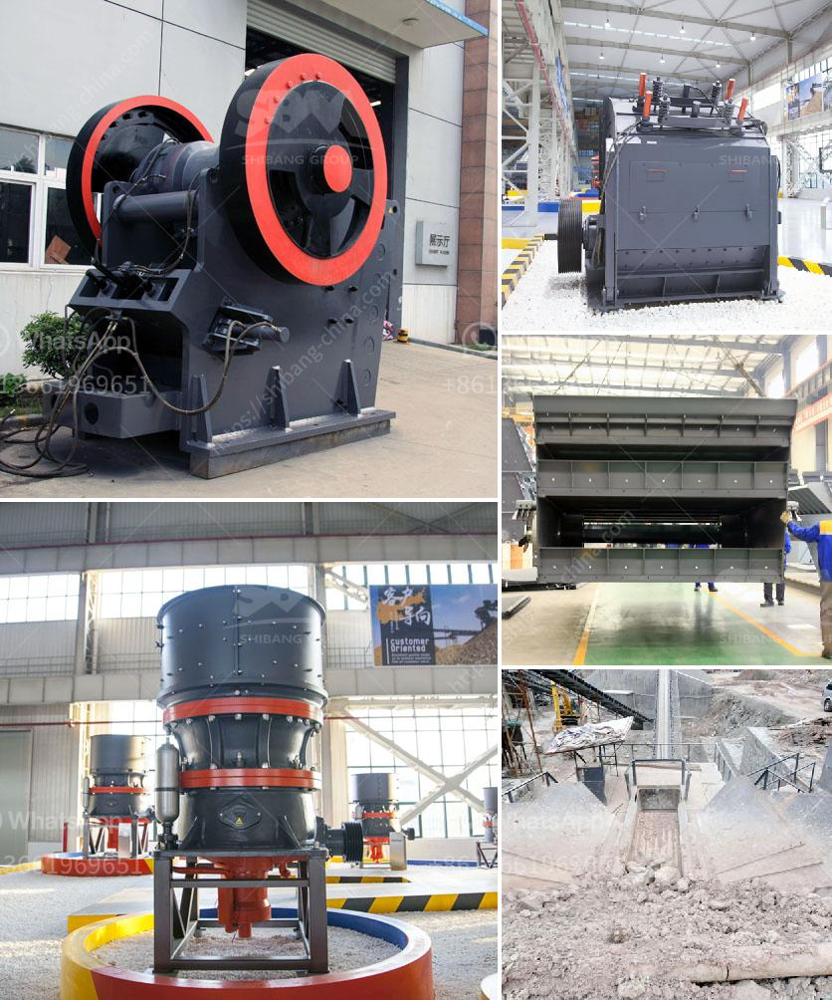

<h3>used marble machinery turkey</h3>
Turkey has been a leading player in the stone industry for centuries. Renowned for its rich natural stone reserves, the country's marble sector has been rapidly growing, thanks to its high-quality stone extraction, production, and processing techniques. One crucial aspect of this growth has been the wide availability of used marble machinery.

The Turkish market offers a vast range of used marble machinery, catering to various segments of the stone industry. These machines include marble cutting and polishing machines, bridge saws, CNC routers, waterjet cutting machines, and many others. Turkish suppliers of used marble machinery provide a cost-effective alternative for businesses looking to upgrade their equipment or expand their production capacity.

One of the key advantages of purchasing used marble machinery in Turkey is the excellent quality of the machines. Turkey has a well-established reputation for producing robust and durable stone processing machinery. This reliability stems from the country's extensive experience in the stone industry and its commitment to integrating advanced technologies into its machines. Buyers can have confidence in the performance and longevity of Turkish used marble machinery.

Furthermore, acquiring used marble machinery from Turkey offers significant advantages in terms of affordability. The Turkish market is highly competitive, resulting in reasonable prices for top-quality machines. This pricing advantage allows businesses to allocate their budget more efficiently and invest in other areas such as marketing, research, or expanding their product range.

Turkish suppliers of used marble machinery also offer additional services like installation, maintenance, and technical support. They understand the importance of customer satisfaction and strive to ensure a seamless transition for buyers who choose to invest in their machines. This level of service helps buyers optimize the usage of their new equipment and minimize downtime.

In conclusion, the availability of used marble machinery in Turkey has become a game-changer for the stone industry. Turkish suppliers offer high-quality machines at affordable prices, allowing businesses to enhance their productivity while optimizing their budgets. With their extensive experience and commitment to customer satisfaction, Turkish suppliers are poised to contribute significantly to the growth and success of the stone industry worldwide.
<h3>Contact us</h3><ul><li><strong>Whatsapp:&nbsp;<a href="https://wa.me/8613661969651">+8613661969651</a></strong></li><li><a href="https://swt.shibang-china.com/?git&amp;zhl&amp;used marble machinery turkey"><strong>Online Service(chat now)</strong></a></li></ul><h3>Related</h3><ul><li><a href='stone crushing business estimate.md'>stone crushing business estimate</a></li><li><a href='simple gold mining machinery with prices.md'>simple gold mining machinery with prices</a></li><li><a href='mobile jaw crushers for sale in italy.md'>mobile jaw crushers for sale in italy</a></li><li><a href='second hand cement mill in india.md'>second hand cement mill in india</a></li><li><a href='sand making machine.md'>sand making machine</a></li></ul>