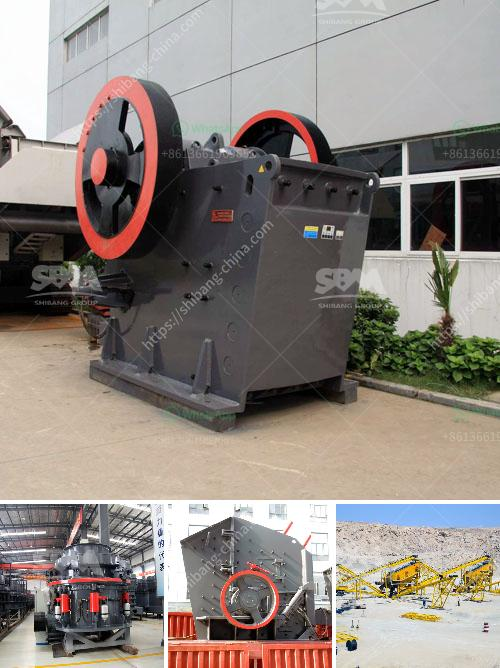

<h3>used mining equipment uk</h3>
Mining plays a crucial role in the UK's economy, providing essential raw materials for various industries. As mining projects become increasingly complex, the need for efficient and reliable equipment has grown significantly. While new mining equipment offers cutting-edge technology and enhanced features, there are compelling reasons to consider investing in used mining equipment in the UK. This article explores the advantages and considerations associated with purchasing used mining equipment in the UK.

1. Cost-effectiveness: One of the primary advantages of buying used mining equipment is the cost savings. Used equipment is typically priced significantly lower than its new counterpart, making it a cost-effective option, especially for small or medium-sized mining operations. By investing in used equipment, mining companies can allocate their resources more efficiently and achieve a faster return on investment.

2. Immediate availability: Acquiring new mining equipment often involves substantial lead times, as manufacturers may face delays in production or demand outstrips supply. On the contrary, used mining equipment is readily available in the UK market. This allows miners to swiftly replace or expand their equipment fleet, minimizing downtime and ensuring uninterrupted productivity.

3. Tested and proven performance: Used equipment has a track record of performance, providing assurance of its reliability. Mining equipment undergoes rigorous testing and maintenance during its operational life, ensuring it can withstand demanding mining conditions. Buying used equipment allows miners to capitalize on the experience and knowledge gained from equipment's previous use, reducing the potential for unexpected breakdowns.

1. Inspection and maintenance history: Before finalizing a purchase, potential buyers should request a detailed inspection and maintenance history of the used mining equipment. This information is crucial to gauge the equipment's condition and ascertain if any major repairs or replacements are necessary. A thorough examination can help buyers make well-informed decisions and anticipate any future maintenance costs.

2. Compatibility and scalability: Assessing the compatibility of used equipment is essential, particularly if integrating it with the existing fleet. Factors like compatibility of spare parts, software, and operational requirements should be considered. Additionally, it is prudent to evaluate the scalability of the used equipment to ensure it aligns with future growth plans and technological advancements.

3. Supplier reputation and support: Researching the reputation and credibility of the supplier is crucial when purchasing used mining equipment. A reputable supplier will provide comprehensive support, including warranties, technical assistance, and spare parts availability. Engaging with a trusted supplier ensures a smooth buying experience and minimizes the risk of acquiring low-quality or misrepresented equipment.

Buying used mining equipment in the UK presents a compelling proposition for mining companies aiming for cost-effectiveness, immediate availability, and proven performance. By considering the advantages and considerations discussed above, mining operations can strategically acquire used equipment that meets their requirements, boosts productivity, and accelerates their business growth while maximizing budgetary allocations.
<h3>Contact us</h3><ul><li><strong>Whatsapp:&nbsp;<a href="https://wa.me/8613661969651">+8613661969651</a></strong></li><li><a href="https://swt.shibang-china.com/?git&amp;zhl&amp;used mining equipment uk"><strong>Online Service(chat now)</strong></a></li></ul><h3>Related</h3><ul><li><a href='calcium powder plant.md'>calcium powder plant</a></li><li><a href='crushing equipment granite quarry nigeria.md'>crushing equipment granite quarry nigeria</a></li><li><a href='metal detector for iron ore crushing plant.md'>metal detector for iron ore crushing plant</a></li><li><a href='small superfine grinder price malaysia.md'>small superfine grinder price malaysia</a></li><li><a href='small rock crushers in turkey.md'>small rock crushers in turkey</a></li></ul>