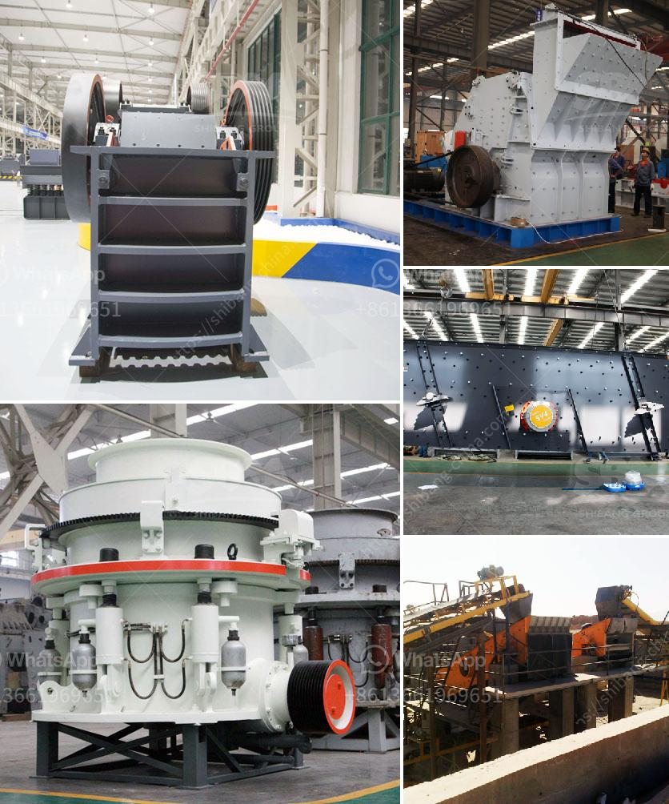

<h3>used mobile coal screening plants</h3>
Coal continues to play a vital role in powering the world, with its affordability and abundance making it a preferred choice for many industries. However, the efficient processing of coal requires reliable screening plants that can separate the desired material from unwanted impurities. In recent years, the market for used mobile coal screening plants has gained significant momentum, thanks to their cost-effectiveness and flexibility.

Mobile coal screening plants, as the name suggests, are designed to be transported easily from one location to another, providing operators with the convenience of screening coal at different sites. This flexibility allows mining companies and contractors to optimize their coal processing operations, reducing transportation costs and enhancing efficiency.

One of the key advantages of used mobile coal screening plants is their cost-effectiveness. Investing in new screening equipment can involve a substantial amount of capital, which may not be feasible for many small and medium-sized businesses. By opting for used plants, companies can enjoy significant savings without compromising on quality. These pre-owned machines are thoroughly inspected and refurbished, ensuring that they are in optimal working condition and can deliver the required screening performance.

Another benefit offered by used mobile coal screening plants is their versatility. These plants are equipped with various screening decks, allowing the separation of coal into different grain sizes. This flexibility ensures that the coal can be tailored to the specific requirements of different industries, such as power generation, steelmaking, or cement production. Moreover, the plants can be easily adjusted to adapt to changing market demands, enabling operators to respond swiftly to fluctuations in coal quality and customer preferences.

Furthermore, the mobility of these plants enables on-site screening, saving time and effort in transporting coal to distant screening facilities. This is particularly advantageous for remote or inaccessible coal mining locations, where the cost of transportation can be significant. By eliminating the need for long-haul transportation, mobile coal screening plants help reduce carbon emissions, contributing to a greener and more sustainable future.

To ensure the highest levels of efficiency and productivity, used mobile coal screening plants are equipped with advanced screening technologies. These technologies incorporate features such as variable speed drive systems, self-cleaning screens, and automated material flow control. Additionally, remote monitoring and diagnostic capabilities enable operators to monitor the screening process in real-time, making adjustments as necessary to optimize performance and minimize downtime.

In conclusion, used mobile coal screening plants offer a practical and economical solution for efficient coal processing. Their cost-effectiveness, versatility, and mobility make them an attractive choice for mining companies and contractors seeking to maximize their coal processing operations. With the right screening technology and maintenance support, these plants can deliver consistent coal quality, meeting the demands of various industries. As the world continues to rely on coal as an energy source, embracing innovative solutions like used mobile coal screening plants can contribute to sustainable and responsible coal processing practices.
<h3>Contact us</h3><ul><li><strong>Whatsapp:&nbsp;<a href="https://wa.me/8613661969651">+8613661969651</a></strong></li><li><a href="https://swt.shibang-china.com/?git&amp;zhl&amp;used mobile coal screening plants"><strong>Online Service(chat now)</strong></a></li></ul><h3>Related</h3><ul><li><a href='process of limestone mining to market.md'>process of limestone mining to market</a></li><li><a href='pulverizers bauxite.md'>pulverizers bauxite</a></li><li><a href='stone crusher for sale.md'>stone crusher for sale</a></li><li><a href='smallfine powder grinding machine nigeria.md'>smallfine powder grinding machine nigeria</a></li><li><a href='coal machines for sale in south africa.md'>coal machines for sale in south africa</a></li></ul>