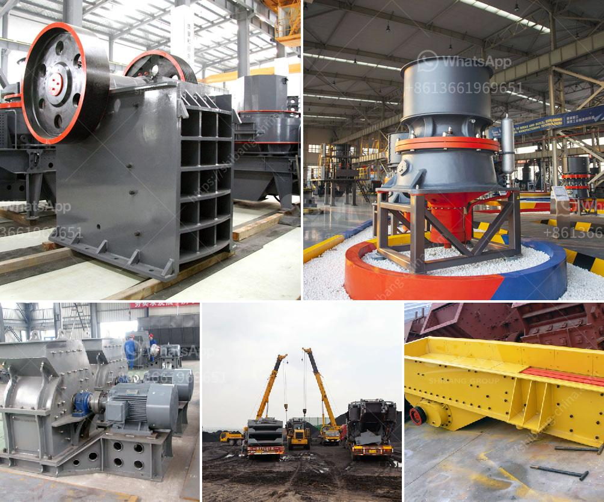

<h3>used portable impact crusher for sale in uae</h3>
If you are in the construction or mining industry, you understand the importance of having efficient and reliable equipment. One such equipment that plays a pivotal role is a portable impact crusher. This versatile machine is designed to handle a wide range of materials and applications, making it a valuable asset in any job site.

When it comes to acquiring a portable impact crusher, going for a used one can be a cost-effective choice, especially in the United Arab Emirates (UAE) where high-quality machines are readily available. The UAE is known for its thriving construction and mining sectors, making it a hub for used equipment sales.

The advantages of purchasing a used portable impact crusher in the UAE are plentiful. The lower upfront cost is one of the decisive factors for many buyers. However, cost is not the only benefit. You also have the opportunity to choose from a wide range of models and brands, each with its own set of unique features tailored to different applications.

The UAE is home to many reputable dealers and suppliers of used portable impact crushers. These professionals thoroughly inspect and refurbish the machines to ensure their functionality and performance. Some dealers even offer warranties, so you can have peace of mind knowing that your investment is protected.

By opting for a used portable impact crusher, you can significantly reduce your carbon footprint. Recycling and reusing equipment not only helps conserve resources, but it also allows you to contribute to sustainability efforts in the industry.

Another advantage of buying a used portable impact crusher in the UAE is the ease of transport. These machines are designed to be easily transported and set up on various job sites, making them suitable for both stationary and mobile applications. Whether you are working on a small-scale project or a large-scale construction site, a portable impact crusher can add value to your operations.

In conclusion, if you are looking for a cost-effective and reliable solution for your crushing needs, consider purchasing a used portable impact crusher in the UAE. With a wide selection of models and brands available, along with the added benefits of lower cost, warranties, and sustainability, you can find a machine that suits your requirements and enhances your productivity. So why wait? Explore the options available and find the perfect used portable impact crusher for sale in the UAE today.
<h3>Contact us</h3><ul><li><strong>Whatsapp:&nbsp;<a href="https://wa.me/8613661969651">+8613661969651</a></strong></li><li><a href="https://swt.shibang-china.com/?git&amp;zhl&amp;used portable impact crusher for sale in uae"><strong>Online Service(chat now)</strong></a></li></ul><h3>Related</h3><ul><li><a href='zircon sand mining companies list in canada.md'>zircon sand mining companies list in canada</a></li><li><a href='fly ash grinding mill.md'>fly ash grinding mill</a></li><li><a href='german technology ball grinding machine.md'>german technology ball grinding machine</a></li><li><a href='small rock crushers in turkey.md'>small rock crushers in turkey</a></li><li><a href='vertical ultra fine pulverizer.md'>vertical ultra fine pulverizer</a></li></ul>