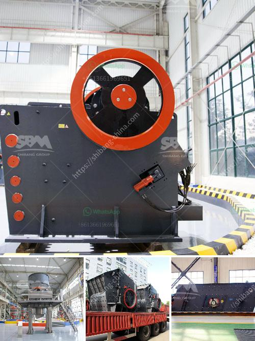

<h3>used portable roller crushers and screens scmmining</h3>
In the world of mining, the need for efficient and cost-effective equipment is paramount. Whether it be for extracting minerals or processing aggregates, having the right tools can make a significant difference in productivity and profitability. One such tool that has gained popularity in recent years is the portable roller crusher and screen.

Portable roller crushers and screens offer a versatile and efficient way to process a wide variety of materials on-site. From construction waste to coarse aggregates, these machines can handle it all. Traditional crushers and screens are often oversized and require extensive setup time, which can cause delays and increase costs. However, portable roller crushers and screens eliminate these issues.

One of the primary advantages of portable roller crushers and screens is their mobility. These machines can be easily transported from one location to another, allowing mining operations to move with ease and flexibility. This is especially beneficial for remote mining sites or temporary projects, where transporting heavy equipment may not be feasible.

Another significant advantage of portable roller crushers and screens is their compact design. These machines are specifically built to be space-saving, making them ideal for tight mining sites or areas with limited access. Unlike traditional crushers and screens, which require extensive foundations and structures, portable roller crushers and screens can be set up on minimal supports, reducing overall costs and installation time.

Furthermore, portable roller crushers and screens offer increased efficiency compared to traditional equipment. Their unique design allows for better material handling and processing. The roller crusher, for example, features two parallel toothed rollers that crush materials by compressing and grinding them. This results in a more uniform and consistent output size, which can be essential in mining operations.

In addition to their efficiency, portable roller crushers and screens also offer cost savings. Many mining operations opt for used equipment, which can significantly reduce upfront investment costs. Pre-owned portable roller crushers and screens can be found in good condition and at a fraction of the price of new equipment. This is especially beneficial for small-scale mining operations or companies with budget constraints.

Moreover, portable roller crushers and screens are designed to be durable and reliable. Robust construction materials and components ensure that these machines can withstand the harshest operating conditions. This reduces the risk of downtime and costly repairs, maximizing productivity and profitability.

In conclusion, used portable roller crushers and screens provide a cost-effective solution for mining operations. Their mobility, compact design, and increased efficiency make them ideal for a wide range of applications. By opting for pre-owned equipment, mining companies can save on upfront costs while still benefiting from reliable and durable machinery. With the right portable roller crushers and screens, mining operations can achieve higher productivity and profitability, delivering a positive impact on the industry as a whole.
<h3>Contact us</h3><ul><li><strong>Whatsapp:&nbsp;<a href="https://wa.me/8613661969651">+8613661969651</a></strong></li><li><a href="https://swt.shibang-china.com/?git&amp;zhl&amp;used portable roller crushers and screens scmmining"><strong>Online Service(chat now)</strong></a></li></ul><h3>Related</h3><ul><li><a href='bal mill snsttlled capacity.md'>bal mill snsttlled capacity</a></li><li><a href='feldspar stone for sale india.md'>feldspar stone for sale india</a></li><li><a href='metal pulverizer crusher suppliers.md'>metal pulverizer crusher suppliers</a></li><li><a href='impact crusher specifications.md'>impact crusher specifications</a></li><li><a href='stone crusher plant 80 ton.md'>stone crusher plant 80 ton</a></li></ul>