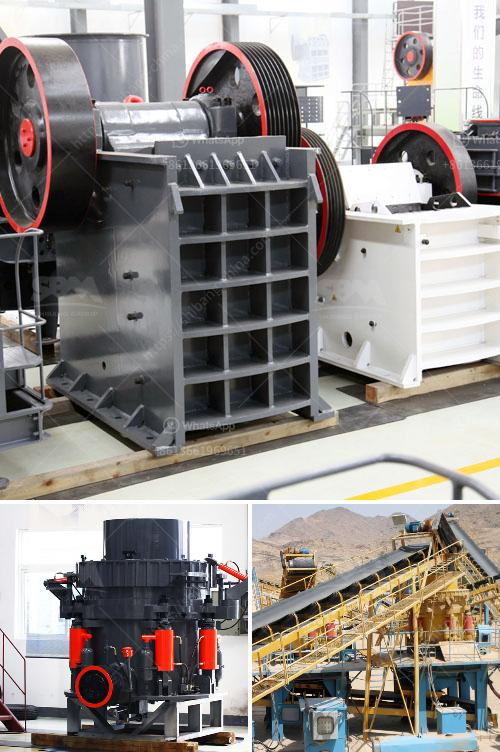

<h3>used portable stone crusher machine for sale usa</h3>
The demand for stone in the construction industry is well-known. It is estimated that there are over 12,000 stone crushing units in the United States. Stone crushing generally involves the processing of raw materials into the desired shape and size. Various types of crushers are used in the stone crushing industry such as Jaw Crushers, Roller Crushers, Cone Crushers, Impactor, Rotopoctor, etc.

Portable stone crusher machines are specially designed and built to break down the large-sized stones into smaller pieces, making them suitable for easily handling and transporting. In the past, many stone crushing machines were both fixed and mobile, but now, portable stone crusher machines are widely used. These machines are highly efficient and can be easily transported from one location to another, thus saving a significant amount of transportation costs.

The USA has a huge demand for stone due to its construction activities. In order to meet this demand, many stone crushing companies have set up shop in various parts of the country. These companies procure stones from nearby quarries and then process them to produce the required output. However, there are times when the stone needs to be crushed at a different location. This is where portable stone crusher machines come into play.

Used portable stone crusher machines for sale in the USA have been widely used for a long time in various construction projects. With the advancement of technology, portable stone crusher machines have been developed to be more efficient and reliable, making them highly sought after in the construction industry. These machines are also commonly used in recycling applications to process various materials such as concrete, asphalt, and demolition waste.

There are many advantages to using portable stone crusher machines. Firstly, they are highly flexible and can be easily transported to any location, whether it is for a temporary construction project or a long-term mining operation. Secondly, these machines are cost-effective as they eliminate the need for expensive transportation of stones from the quarry to the crushing site. Thirdly, portable stone crusher machines are easy to operate and maintain. They require minimal training and can be operated by a single person.

When looking for used portable stone crusher machines for sale in the USA, it is important to consider several factors. Firstly, the condition of the machine should be thoroughly evaluated to ensure that it is in good working order. Secondly, the reputation and reliability of the seller should be checked to avoid any scams or fraudulent transactions. Lastly, the price of the machine should be compared with other similar machines in the market to ensure that it is fair and competitive.

In conclusion, portable stone crusher machines are widely used in the USA for various construction projects. These machines are highly efficient, reliable, and cost-effective. They provide a convenient solution for crushing stones at different locations, saving time and transportation costs. However, it is important to carefully evaluate the condition and reputation of the seller before purchasing a used portable stone crusher machine to ensure a successful and hassle-free transaction.
<h3>Contact us</h3><ul><li><strong>Whatsapp:&nbsp;<a href="https://wa.me/8613661969651">+8613661969651</a></strong></li><li><a href="https://swt.shibang-china.com/?git&amp;zhl&amp;used portable stone crusher machine for sale usa"><strong>Online Service(chat now)</strong></a></li></ul><h3>Related</h3><ul><li><a href='mini cement plant grinding project report.md'>mini cement plant grinding project report</a></li><li><a href='iron ore mining crushing process.md'>iron ore mining crushing process</a></li><li><a href='ore crusher mining equipment business plan.md'>ore crusher mining equipment business plan</a></li><li><a href='malaysia stone crushing machine crusher for sale.md'>malaysia stone crushing machine crusher for sale</a></li><li><a href='stone crushing machine factories in shanghai.md'>stone crushing machine factories in shanghai</a></li></ul>