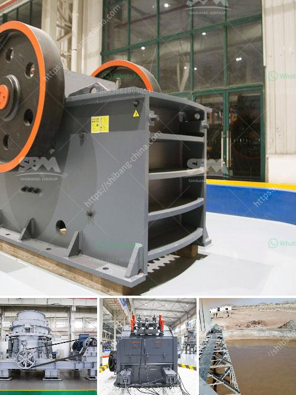

<h3>used quarry equipment for sale in nigeria</h3>
Nigeria is richly endowed with granite stone and other related solid minerals like Marble, Dolomite and Basalt, among others. Granite stone is one of the most popular construction materials used in building due to its strength and durability. However, the high cost of new quarry equipment can be a major hindrance to many individuals and small-scale quarry operators. Therefore, there is a need for individuals and organizations to explore the option of buying used quarry equipment for sale in Nigeria.

Buying used quarry equipment for sale in Nigeria can be a great way to save money and help preserve the environment. However, many individuals and companies are wary of the idea, citing poor performance and lack of warranty on used equipment. This article will discuss some of the pros and cons of buying used quarry equipment in Nigeria.

One of the biggest advantages of buying used quarry equipment is that it is already broken in. This means that any problems that may have occurred during its initial use would have been addressed, making it less likely for issues to arise in the future. Additionally, used equipment is often sold at a lower price compared to new equipment, allowing buyers to save money.

However, it is important for buyers to carefully inspect the used quarry equipment before making a purchase. They should thoroughly evaluate the equipment for any wear and tear, rust, or cracks that may affect its performance. It is also important to verify the usage hours of the equipment, as excessive use may have reduced its efficiency or lifespan.

Another concern for buyers is the lack of warranty on used quarry equipment. Unlike new equipment, used equipment may not come with a warranty, leaving buyers responsible for any repairs or maintenance costs. It is therefore recommended for buyers to inquire about the maintenance history of the equipment and hire a professional to inspect it thoroughly.

In conclusion, buying used quarry equipment for sale in Nigeria can be a viable option for individuals and small-scale quarry operators because of its affordability and reduced risk of immediate breakdown. However, caution must be exercised, and buyers should ensure the equipment is in good condition and has not been overly used. Additionally, it is essential to evaluate the maintenance history of the equipment before making a purchase. By doing so, buyers can acquire reliable equipment at a fraction of the cost and contribute to the conservation of resources in Nigeria.
<h3>Contact us</h3><ul><li><strong>Whatsapp:&nbsp;<a href="https://wa.me/8613661969651">+8613661969651</a></strong></li><li><a href="https://swt.shibang-china.com/?git&amp;zhl&amp;used quarry equipment for sale in nigeria"><strong>Online Service(chat now)</strong></a></li></ul><h3>Related</h3><ul><li><a href='processing of calcium carbonate.md'>processing of calcium carbonate</a></li><li><a href='used raymond grinding mill sale in pakistan.md'>used raymond grinding mill sale in pakistan</a></li><li><a href='vertical mill for sale.md'>vertical mill for sale</a></li><li><a href='grinding marble stone price.md'>grinding marble stone price</a></li><li><a href='limestone powder making plant ireland.md'>limestone powder making plant ireland</a></li></ul>